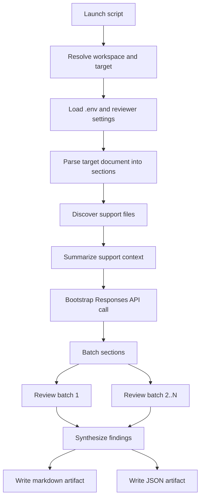
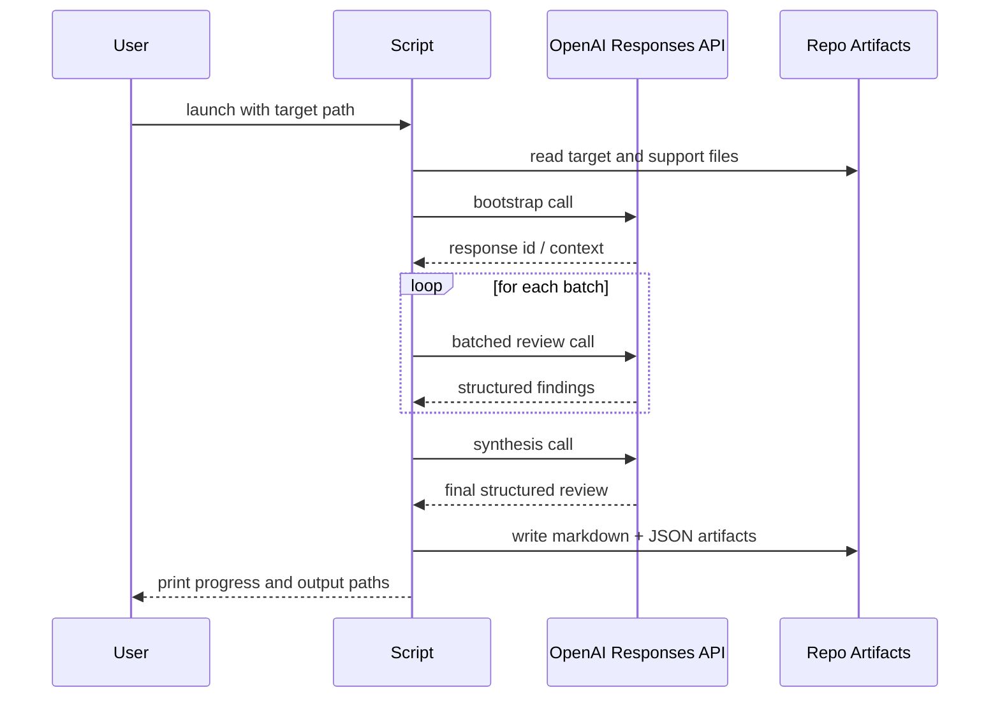
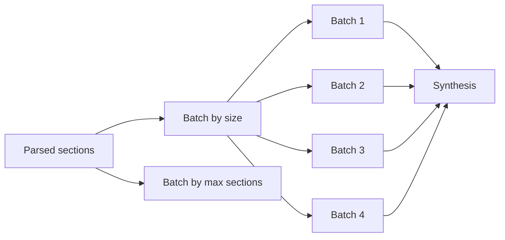

# OpenAI Reasoned Reviewer

This document describes the workspace reviewer implemented in
[`_scripts/openai_reasoned_review.py`](../_scripts/openai_reasoned_review.py).
It is the operational reference for anyone launching, tuning, debugging, or
extending the OpenAI-backed deep technical review workflow.

## Purpose

The reviewer exists to perform a deeper engineering-document critique than the
baseline repo review skill can provide on its own. It is intended for reports
that need all of the following at once:

- contradiction checks across long technical narratives
- claim-to-evidence traceability review
- thermodynamic and unit consistency review
- comparison of prose against generated tables and summaries
- structured findings suitable for review artifacts and downstream tooling

The current default model is `o3`, invoked through the OpenAI `Responses` API.

## What It Does

At a high level, the reviewer:

1. resolves the workspace and target document
2. parses the target into reviewable sections
3. discovers nearby supporting artifacts
4. prepares shared context with a bootstrap call
5. reviews the document in batched section groups
6. synthesizes the batched findings into one final report
7. writes a markdown artifact and a JSON artifact

Outputs:

- Markdown:
  `projects/<project>/Reviews/Review-<stem>-reasoned.md`
- JSON:
  `_state/<project>/reviews/<stem>-reasoned.json`

The `-reasoned` suffix is intentional. It prevents accidental overwrite of
human-authored review artifacts.

## Where It Fits

The reviewer is one piece of the larger review stack:

- `technical-doc-review`
  Baseline technical QA skill
- `reasoned-tech-doc-review`
  Deep-review skill with repo-specific engineering rubric
- `.claude/agents/technical-reviewer.md`
  Workspace agent prompt that can invoke the reviewer script
- `_scripts/openai_reasoned_review.py`
  Actual API-backed execution path

The script is the concrete runtime. The skills and agent definition describe
when it should be used and what standard it should meet.

## Review Workflow



### Launch Modes

The reviewer can be launched in three main ways:

1. direct command-line execution
2. indirect use through the `technical-reviewer` agent
3. explicit operator use while debugging harness behavior

Canonical command:

```powershell
& 'D:\Quarto\.venv\Scripts\python.exe' _scripts\openai_reasoned_review.py projects\shipping\failure-mechanism.qmd
```

Useful flags:

- `--support <paths>`
- `--model o3`
- `--no-supporting`
- `--json-only`
- `--max-sections 2`
- `--quiet`

## Request Lifecycle



## Parsing Model

### Supported target types

- `.qmd`
- `.md`
- `.docx`

### Sectioning behavior

Markdown and Quarto files are split on Markdown headings.

Important implementation detail:

- fenced code blocks are ignored when looking for headings

That matters because large Quarto reports often contain Python chunks with
comment lines that start with `#`. Without fence awareness, those comment lines
get misread as document headings and explode the number of review calls.

### Chunking behavior

Very long sections are split into parts, preserving:

- section title
- file-based location string
- text content

The current section chunking threshold is:

- `MAX_SECTION_CHARS = 7500`

## Support-File Discovery

When the target is under `projects/<project>/`, the reviewer will look for:

- project `_quarto.yml`
- `SESSION_HANDOFF.md`
- project or shared bibliography files
- `generated/*.tsv`
- `generated/*.csv`
- `generated/*.md`
- prior reviews under `Reviews/`
- shared metadata such as `_shared/_metadata.yml`

These files are not blindly pasted into the prompt. The script summarizes them
into a bounded support-context payload.

## Batching Strategy

The reviewer originally made one OpenAI call per parsed section. That is too
slow and too expensive for large Quarto reports, especially when using `o3`
with `reasoning_effort=high`.

The current strategy groups adjacent sections into batches before review.

Default batching controls:

- `TECH_DOC_REVIEW_BATCH_CHARS = 30000`
- `TECH_DOC_REVIEW_MAX_SECTIONS_PER_BATCH = 10`

The effective call pattern is:

1. bootstrap
2. N batched review calls
3. synthesis

For `projects/shipping/failure-mechanism.qmd`, the current parser and defaults
group the full document into approximately 4 batched review calls instead of a
one-call-per-section strategy.



## Harness Behavior

This section matters if the reviewer is launched by an automated shell harness,
background task wrapper, or a long-running task manager.

### What used to go wrong

Earlier versions of the script could look dead because:

- they emitted no output until the very end
- they wrote the final review artifacts only after synthesis
- they performed many expensive `o3` calls in sequence

That combination made a background harness show:

- a 0-byte log file
- no apparent process output
- no indication of whether the OpenAI call had started

### Current behavior

The script now emits progress logs to stdout as it runs:

- workspace root resolved
- target resolved
- parsed section count
- support-file count
- runtime configuration
- bootstrap start and completion
- batch start and completion
- synthesis start and completion
- artifact write paths

This makes background launches observable even when the OpenAI calls themselves
take time.

### Why stdout, not stderr

Routine progress logs are written to stdout so PowerShell and similar shells do
not reinterpret normal progress output as an error record.

Actual failure conditions still surface as real exceptions or explicit
stderr-oriented error messages from the script entrypoint.

## Environment Variables

The reviewer understands these runtime settings:

- `OPENAI_API_KEY`
  Required for API-backed review
- `TECH_DOC_REVIEW_MODEL`
  Default: `o3`
- `TECH_DOC_REVIEW_REASONING_EFFORT`
  Default: `high`
- `TECH_DOC_REVIEW_TIMEOUT_SECONDS`
  Default: `300`
- `TECH_DOC_REVIEW_INCLUDE_SUPPORTING`
  Default: `true`
- `TECH_DOC_REVIEW_MAX_SECTIONS`
  Optional cap for bounded runs
- `TECH_DOC_REVIEW_BATCH_CHARS`
  Default: `30000`
- `TECH_DOC_REVIEW_MAX_SECTIONS_PER_BATCH`
  Default: `10`

Recommended debugging pattern:

```powershell
$env:TECH_DOC_REVIEW_TIMEOUT_SECONDS='300'
$env:TECH_DOC_REVIEW_BATCH_CHARS='30000'
$env:TECH_DOC_REVIEW_MAX_SECTIONS_PER_BATCH='10'
& 'D:\Quarto\.venv\Scripts\python.exe' _scripts\openai_reasoned_review.py projects\shipping\failure-mechanism.qmd
```

Recommended bounded smoke test:

```powershell
& 'D:\Quarto\.venv\Scripts\python.exe' _scripts\openai_reasoned_review.py projects\shipping\failure-mechanism.qmd --max-sections 2
```

## Error Handling

The reviewer now surfaces:

- missing `OPENAI_API_KEY`
- package import problems
- API timeouts
- API connectivity failures
- non-success API status responses
- schema-parse failures

Examples of failure messaging:

- bootstrap timeout
- batch timeout
- synthesis timeout
- connection failure
- status code failure

The goal is to fail loudly and specifically rather than appear to hang.

## Artifact Semantics

### Markdown artifact

Human-readable findings-first review:

- summary
- findings
- residual risks
- sources checked

### JSON artifact

Machine-readable review payload:

- `summary`
- `findings[]`
- `residual_risks[]`
- `sources_checked[]`
- `target`

The JSON artifact is the right place to integrate future automation such as:

- review dashboards
- evaluations
- disposition workflows
- comparison across prompt/model revisions

## Troubleshooting

### The script looks hung

Check whether progress logs are still advancing.

If they stop at:

- bootstrap:
  likely model/API/network/startup issue
- a batch:
  likely timeout or very large batch payload
- synthesis:
  likely final payload is large or the model is slow

### The background harness shows 0-byte output

That usually means one of these:

- the old version of the script is being used
- stdout is not being captured correctly by the harness
- the process never really launched

With the current script, a live run should emit progress lines almost
immediately.

### Full-document runs are still too slow

Options:

1. increase `TECH_DOC_REVIEW_BATCH_CHARS`
2. increase `TECH_DOC_REVIEW_MAX_SECTIONS_PER_BATCH`
3. lower `TECH_DOC_REVIEW_REASONING_EFFORT`
4. run with `--max-sections` for a bounded pass
5. reduce the number of support files or support-file summary size

### Findings look wrong or too aggressive

The reviewer is still a model-mediated system. The right response is:

1. compare the finding against repo evidence
2. inspect the specific source location
3. rerun with fewer sections if needed
4. treat the artifact as a review aid, not blind authority

## Suggested Future Improvements

Near-term improvements:

- preserve a lightweight timing summary per phase
- add optional checkpoint writes between batches
- add a “review only these section ids” mode
- trim or rank support files more aggressively

Longer-term improvements:

- evaluation corpus under `_state/`
- direct source-of-truth adapters for `D:\matlab-mcp`
- optional fix mode after findings
- report-specific profiles for large vs small documents

## Bottom Line

The reviewer is now:

- observable during runtime
- explicit about API failures
- protected against fake heading inflation from code blocks
- materially faster on long Quarto reports because it batches sections before
  review

For day-to-day use, the default launch path should be:

```powershell
& 'D:\Quarto\.venv\Scripts\python.exe' _scripts\openai_reasoned_review.py projects\shipping\failure-mechanism.qmd
```

For debugging or harness verification, start with:

```powershell
& 'D:\Quarto\.venv\Scripts\python.exe' _scripts\openai_reasoned_review.py projects\shipping\failure-mechanism.qmd --max-sections 2
```
