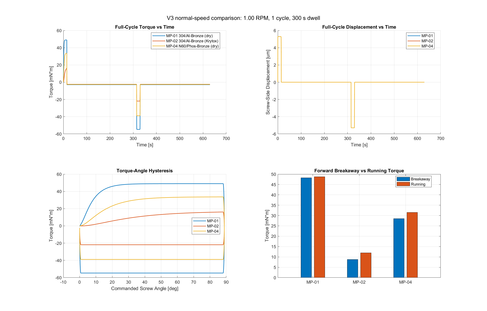

# Summary

This report documents the current Simscape digital twin for the `1/4-80 UN` optical adjuster study defined in [test_plan.R2.md](/D:/matlab-mcp/docs/plans/test_plan.R2.md) and motivated by [report.R2.md](/D:/matlab-mcp/docs/plans/report.R2.md). The digital twin now represents the threaded fixture as a physically structured Simscape model instead of a signal-only surrogate. The active implementation is rooted in [build_v3_model.m](/D:/matlab-mcp/docs/digital-twin/threaded-fastener/model/v3/build_v3_model.m), with supporting analysis paths in [run_v3_restart_probe.m](/D:/matlab-mcp/docs/digital-twin/threaded-fastener/model/v3/run_v3_restart_probe.m) and [run_v3_normal_speed_comparison.m](/D:/matlab-mcp/docs/digital-twin/threaded-fastener/model/v3/run_v3_normal_speed_comparison.m).

The current state supports a clear engineering conclusion. The model structure is physically credible, the current parameterization preserves the expected material ordering, and the simulated torque response is no longer trivial or decorative. The restart probe further shows that the friction formulation is capable of producing a breakaway-to-running drop. At the same time, the fixture-faithful `1 RPM` operating point does not yet show a sufficiently strong dry-pairing restart signature to justify final validation claims.

The digital twin is therefore suitable for a checkpoint commit, technical documentation, and continued engineering use. It is not yet suitable for a final closeout report claiming validated fixture fidelity.

The next logical program step is to build the physical fixture, generate baseline empirical data, and synchronize the model to measured breakaway torque, running torque, hysteresis, drift, and cycle progression. Further purely simulated refinement remains useful, but it is now approaching diminishing returns relative to the value of actual hardware data.

## Why this merits fixture funding

The strongest programmatic argument for the next step is economic as much as technical. A single precision translation or rotation stage of the type being discussed is on the order of `$2,000`, while the dedicated incremental hardware needed to build and run the threaded-fastener fixture is roughly under `$300` in additional parts if an older laptop and existing lab infrastructure are used for control and logging. That means the incremental cost of building the fixture is small relative to the value of the mechanism being protected and very small relative to the downstream value of the optical hardware that depends on reliable adjustment.

More importantly, the fixture does not buy only one decision. It reduces risk in at least three places at once. First, it helps identify the best thread pairing before that choice is frozen into sensitive optical hardware. Second, it creates the empirical dataset needed to turn the present digital twin into a calibrated predictive tool. Third, because the stand uses the real stage architecture under sustained cycling, it also becomes a low-cost life and health monitor for the stage assembly itself. In that sense, the fixture is not a single-purpose expense. It is a leverage point that converts a relatively small spend into a reusable test capability and a meaningful reduction in program risk.

# Objective and Scope

## Objectives

This digital-twin effort exists to support the original test-plan objectives rather than replace them. The current model work contributes to the following objectives:

| OBJ-ID | Objective | Digital-twin role |
|---|---|---|
| OBJ-01 | Measure breakaway torque vs cycle for five candidate pairings | Provide a predictive structure for relative ordering, breakaway behavior, and expected torque magnitude |
| OBJ-04 | Confirm pointing drift over dwell | Provide the initial displacement and dwell-response framework for later drift comparison |
| OBJ-05 | Demonstrate no missed steps with available motor torque margin | Confirm that predicted torque demand remains far below motor capability |
| OBJ-06 | Correlate Simulink breakaway prediction to hardware | Primary objective of the current model work |
| OBJ-07 | Validate friction-coefficient evolution over 25 cycles | Long-term objective that remains open pending empirical data |

## Design intent

The digital twin serves three engineering purposes. First, it reduces bench-test risk by checking whether the proposed fixture and material matrix are physically sensible before hardware assembly. Second, it accelerates interpretation of future measured data by providing a structured mechanical baseline. Third, it creates a reusable model artifact that can evolve from pre-test prediction into a post-test calibrated digital twin.

## In-scope items for this report

This report covers the active `v3` Simscape model, the hardware-to-model mapping for the stepper, torque sensor, thread geometry, preload, and displacement sensing, the current simulation evidence from the evaluator, restart probe, and fixture-speed comparison, and the explicit alignment and non-alignment against the test-plan objectives and claims.

## Out-of-scope items for this report

This report does not claim final model validation, calibrated friction evolution over 25 empirical cycles, particle or outgassing ranking from simulation alone, or final fixture qualification and hardware down-selection.

# Claims and Validation Posture

The original test plan defines five formal claims. The digital twin currently interacts with them as follows:

| Claim | Formal intent from test plan | Current digital-twin status |
|---|---|---|
| C-001 | Predict ordering and magnitude of measured breakaway torques | Partially supported; ordering is strong, fixture-speed breakaway shape is not yet fully convincing |
| C-002 | Relate galling severity to ASTM G98 behavior | Not yet supportable from current simulation alone |
| C-003 | Rank particle generation | Not yet supportable from current simulation alone |
| C-004 | Rank outgassing performance | Out of scope for the current mechanical digital twin |
| C-005 | Preserve precision performance under dwell and cycling | Partially scaffolded via displacement sensing and dwell logic, not yet validated |

The current digital-twin program should therefore be understood as a **C-001-first** effort with partial preparation for C-005. The remaining claims require physical test data.

# Traceability Matrix

## Digital-twin traceability to test-plan claims

| Claim | Fixture feature or control from test plan | Current digital-twin representation | Current evidence | Status | Next validation step |
|---|---|---|---|---|---|
| C-001 | Inline torque transducer, constant preload, controlled motion profile, material pairings | Ideal Torque Sensor, `46.7 N` preload, `1/4-80` leadscrew geometry, pairing-specific friction data | `MFS = 0.9916`; strong pairing ordering; normal-speed and restart-probe outputs | Partial | Compare measured breakaway and running torque against the model after fixture assembly |
| C-002 | Controlled fixture, microscopy, per-cycle torque progression | No direct microscopy or damage-state model in active `v3`; only indirect friction ranking | Relative dry/lubricated ordering is consistent with expected tribology | Open | Add empirical torque-vs-cycle data and surface-inspection feedback |
| C-003 | Particle counter in controlled N2 environment | Not modeled directly | None | Open | Use hardware particle data; model may later support friction-energy interpretation only |
| C-004 | ASTM E595 outgassing testing | Not modeled | None | Open | Handle in material qualification, not in current Simscape mechanics model |
| C-005 | Laser displacement sensor, 5-minute dwell, repeated cycles | Ideal Translational Motion Sensor; dwell logic; fixture-speed comparison mode | Displacement remains stable and plausible in current runs | Partial | Compare modeled dwell drift and repeatability against measured stage behavior |

## Objective-oriented traceability

| Objective | What the digital twin currently provides | What is still missing |
|---|---|---|
| OBJ-01 | Pairing ordering, torque traces, restart-window analysis, normal-speed comparison | Full empirical cycle runner and measured torque comparison |
| OBJ-04 | Dwell-aware motion path and displacement logging | Measured drift synchronization and calibrated stage compliance |
| OBJ-05 | Strong motor-torque margin argument from hardware specs and simulated load demand | Physical missed-step/stall confirmation |
| OBJ-06 | Direct Simscape architecture prepared for measured torque correlation | Actual hardware torque dataset |
| OBJ-07 | Placeholder friction-curve structure through pairing-specific coefficients | Measured 25-cycle evolution and calibrated update law |

# Physical System Definition

## Application

The physical application is a fine-pitch `1/4-80 UN` optical adjuster in a dry-nitrogen environment near room temperature. The system is not a high-duty actuator. It is a precision adjuster that may remain stationary for long periods and then receive a small manual correction. A restart failure after dwell can seize the interface and jeopardize a high-value optical module.

The original report describes the baseline failure mode as adhesive wear, micro-welding, and eventual seizure in a dry stainless/bronze thread pair. That failure mechanism means the digital twin must ultimately support realistic breakaway torque prediction, realistic running-friction prediction, credible material ordering, and later correlation to measured dwell-and-restart behavior.

## Operating protocol

The intended fixture-faithful protocol from [test_plan.R2.md](/D:/matlab-mcp/docs/plans/test_plan.R2.md) is a quarter-turn forward stroke at `1 RPM`, followed by a `5-minute` dwell, followed by a quarter-turn reverse stroke at the same speed, with `25` consecutive cycles minimum.

The report treats slow motion as an intentional engineering choice. It explicitly recommends slow, steady adjustment because rapid spinning or jerky motion increases frictional heating and surface stress. The report also states that the tests are run slowly with cool-down between cycles so heat build-up does not dominate the friction response.

The digital twin therefore treats `1 RPM` as the physically meaningful operating point. Faster motion is acceptable only as a diagnostic probe.

## Fixture significance beyond the threads

The empirical test does not only evaluate the threaded interface. Because the test uses the real multi-axis stage, the hardware program also becomes a life and stability test of the stage-level adjustment mechanism itself. The future hardware campaign should therefore produce evidence on thread friction and breakaway behavior, stage repeatability and drift after dwell, and the longer-duration wear and operational stability of the translation stage assembly. Even after the immediate torque and drift baselines are collected, the same fixture can continue running as an extended life test.

# Hardware and Parameter Baseline

The digital twin currently anchors to the following hardware and geometric values.

| Parameter | Value | Source |
|---|---:|---|
| Thread geometry | `1/4-80 UN` | [test_plan.R2.md](/D:/matlab-mcp/docs/plans/test_plan.R2.md) |
| Lead | `0.3175 mm/rev` | [component_specs.md](/D:/matlab-mcp/docs/fixture/component_specs.md) |
| Mean thread diameter | `5.72 mm` | [component_specs.md](/D:/matlab-mcp/docs/fixture/component_specs.md) |
| Preload force | `46.7 N` | [component_specs.md](/D:/matlab-mcp/docs/fixture/component_specs.md) |
| Motor | `23HM22-2804S` stepper | [component_specs.md](/D:/matlab-mcp/docs/fixture/component_specs.md) |
| Holding torque | `1.26 N*m` | [component_specs.md](/D:/matlab-mcp/docs/fixture/component_specs.md) |
| Rotor inertia | `3.0e-5 kg*m^2` | [component_specs.md](/D:/matlab-mcp/docs/fixture/component_specs.md) |
| Torque sensor basis | `0.035 N*m` rated, `+/-0.04 N*m` working range | [component_specs.md](/D:/matlab-mcp/docs/fixture/component_specs.md) |
| Displacement sensor basis | `0.1 um` nominal resolution, `0.5 um` repeatability | [component_specs.md](/D:/matlab-mcp/docs/fixture/component_specs.md) |

The current motor representation is intentionally simplified. The model uses a prescribed velocity source rather than an explicit electrical stepper-drive model because the motor is not the limiting subsystem at the intended operating point. At `1 RPM`, the motor remains deep inside its torque margin according to the hardware summary.

## Parameter-selection rationale

The current parameter set was not chosen to produce a decorative match. Each parameter falls into one of three categories: directly documented fixture values, geometry-driven derived values, and engineering tuning values that remain open to later calibration.

The thread geometry, lead, preload, motor identity, rotor inertia, and sensor basis all belong to the first category. These values are carried directly from the hardware summary and fixture documentation. They are the part of the model that should change only if the hardware definition changes.

The second category consists of quantities implied by geometry and kinematics. The leadscrew converts angular motion to axial travel using the real thread lead, and the torque demand scales with preload and effective radius in the usual way. That means a significant portion of the torque-level behavior is constrained by the fixture itself rather than by arbitrary tuning.

The third category contains the friction-law shape parameters: `mu_s`, `mu_c`, `v_s`, and `sigma`. These values are currently engineering estimates chosen to preserve expected dry-versus-lubricated ordering and to produce restart behavior that is qualitatively plausible. They should be treated as pre-test priors, not as validated material constants for the assembled fixture.

This distinction is important for interpretation. The model is already well grounded in geometry and hardware, but the friction-law shape remains the main calibration surface for future empirical synchronization.

## Governing relations used in the current model

The current digital twin is not an abstract black box. Its main behaviors are tied to a small set of recognizable mechanical relations. The commanded rotary motion is converted to axial travel by the screw lead according to

$$
x(t) = \frac{L}{2\pi}\,\theta(t)
$$

where $L$ is the thread lead and $\theta(t)$ is the commanded screw rotation. The corresponding equivalent thread-surface speed used for restart-window interpretation is

$$
v_{\mathrm{interface}}(t) = \omega(t)\,\frac{d_{\mathrm{mean}}}{2}
$$

where $\omega(t)$ is the screw angular speed and $d_{\mathrm{mean}}$ is the effective mean thread diameter.

The preload-scaled friction quantities in the current implementation are

$$
F_{\mathrm{breakaway}} = \mu_s\,F_{\mathrm{preload}}
$$

$$
F_{\mathrm{coulomb}} = \mu_c\,F_{\mathrm{preload}}
$$

and the additional breakaway term injected through the translational friction element is

$$
F_{\mathrm{breakaway,extra}} =
\max\!\left(F_{\mathrm{breakaway}} - F_{\mathrm{coulomb}}, \varepsilon\right)
$$

where $\varepsilon$ is a small floor used to avoid a degenerate zero-friction augmentation path. In its present form, the model should therefore be understood as a geometry-grounded physical network with a friction-law shape that remains open to calibration.

# Model Architecture

## Model philosophy

The active `v3` model is a Simscape physical-network model. That is the essential architectural change from the earlier signal-based digital-twin line. The current model uses standard library blocks for motion prescription, torque measurement, rotational inertia, leadscrew conversion, translational friction, translational mass, preload forcing, and displacement and velocity measurement. This architecture preserves real physical ports and real block-level couplings. It reduces the temptation to "draw" desired behavior analytically instead of allowing it to emerge from topology and parameters.

## Active load path

The current topology in [build_v3_model.m](/D:/matlab-mcp/docs/digital-twin/threaded-fastener/model/v3/build_v3_model.m) is:

`Motor Drive -> Torque Sensor -> Leadscrew`

From the leadscrew translational side:

`Leadscrew -> Thread Friction -> Stage Mass`

At the translational node, the model also connects an Ideal Force Source for preload and an Ideal Translational Motion Sensor for displacement and velocity. This topology is the current Stage 2B baseline.

## Why the friction is split

The current model assigns friction in two places. The leadscrew block carries the geometry-based steady friction behavior, and a translational friction block adds the breakaway-sensitive component that the leadscrew block alone did not generate strongly enough.

This split is a deliberate development-stage approximation. It is not yet the final calibrated representation of the real thread interface. It is the current best compromise between preserving steady torque scaling by geometry and producing visible restart-window behavior.

## Block-to-fixture mapping

| Simscape block | Model name | Physical meaning |
|---|---|---|
| Ideal Angular Velocity Source | `Motor Drive` | Prescribed stepper motion |
| Ideal Torque Sensor | `Torque Sensor` | FUTEK inline torque transducer |
| Rotational Inertia | `Motor Inertia` | Rotor and drive-side inertia |
| Leadscrew | `Leadscrew` | Real thread geometry and steady friction conversion |
| Translational Friction | `Thread Friction` | Additional restart-sensitive thread/interface friction |
| Mass | `Stage Mass` | Translation-stage moving mass |
| Ideal Force Source | `Preload Force` | Spring preload |
| Translational Motion Sensor | `Position Sensor` | Keyence displacement measurement branch |

## Block-by-block walkthrough

The current model can be explained cleanly as a left-to-right energy and measurement chain.

### 1. Velocity command and drive boundary

The `Vel Profile` and `Motor Drive` pair define the imposed operating profile. This is a modeling choice rather than a claim about motor commutation physics. The stepper is represented as a commanded motion source because the test-plan question is dominated by the mechanical load path, not by drive-electronics behavior.

This means the model answers the question of what torque and displacement behavior the mechanical stack should produce for a known commanded slow adjuster motion, rather than the separate electrical-drive question of how a full stepper system synthesizes that motion. That simplification is justified at the current stage because the available motor torque margin is far above the modeled torque demand.

### 2. Torque measurement and rotational inertia

The `Torque Sensor` sits directly in the drive path so that the logged signal corresponds to the same quantity the inline FUTEK sensor will measure in the physical fixture. The `Motor Inertia` represents the rotor-side inertia that must be accelerated and decelerated during reversals and restart events.

This branch is important because onset transients are not purely friction phenomena. They also include the inertia and compliance consequences of reversing or re-establishing motion after dwell.

### 3. Leadscrew conversion

The `Leadscrew` block is the core geometric converter. It maps the commanded rotary motion into fine axial travel using the real `1/4-80` lead. It also contributes the steady friction behavior associated with the screw conversion process. Without this block, the model would no longer be constrained by the real pitch and mechanical advantage of the adjuster.

### 4. Thread-interface friction augmentation

The `Thread Friction` block sits on the translational side because the current `v3` model uses it to recover the breakaway-sensitive portion of the threaded-interface behavior that the leadscrew block alone did not express strongly enough. This is the main place where the digital twin is still explicitly developmental rather than fully calibrated.

In practical terms, the leadscrew block anchors the steady geometric conversion while the extra friction block shapes the onset and low-speed transition behavior.

### 5. Stage mass and preload forcing

The `Stage Mass` block represents the moving hardware being translated by the screw. The `Preload Force` block injects the spring-load condition that establishes normal force at the interface. Because friction force is fundamentally preload dependent, this branch is central to both the running torque and breakaway torque behavior.

In other words, the preload branch is not a side detail. It is one of the dominant physical inputs to the thread torque demand.

### 6. Position and velocity sensing

The `Position Sensor` reads the screw-side translational state and exports both position and velocity through the PS-S converters. This is the current analog of the Keyence displacement measurement path. The sensor branch supports displacement plausibility checks, dwell stability checks, later drift correlation, and restart-window velocity inspection for Stribeck-style analysis.

## Current simplifications

The current model still omits explicit bellows-coupling compliance, explicit torsional elasticity in the drive train, explicit ball-tip and sapphire contact mechanics, temperature-dependent friction feedback, and an empirically calibrated cycle-evolution state. These omissions are acceptable for a checkpoint model, but they remain important limitations for final validation.

## Uncertainty and error budget

The current digital twin has three main uncertainty classes.

### 1. Structural uncertainty

The model does not yet include every elastic and contact element in the fixture. Missing drive-train compliance, ball-tip contact mechanics, and detailed stage mechanics can all reshape the onset transient. This is the main reason the model should not yet be treated as a fixture-faithful truth model.

### 2. Friction-law uncertainty

The friction coefficients and shape parameters are presently engineering values rather than calibrated measurements. That uncertainty directly affects breakaway magnitude, low-speed transition shape, reverse-direction onset behavior, and the apparent emergence or suppression of a Stribeck-like drop.

This is the dominant parametric uncertainty in the present work.

### 3. Measurement-model mismatch

The physical system will include finite sensor noise, wiring, backlash, fixture compliance, and real assembly variability. The current model reads idealized states and idealized torque. That is appropriate for pre-test reasoning, but it means any future synchronization effort must compare like with like and account for sensor bandwidth, filtering, and reference conventions.

# Material Pairings and Friction Parameterization

The current active material database includes five pairings.

| Pairing | Description | `mu_s` | `mu_c` | `v_s [m/s]` | `sigma [s/m]` |
|---|---|---:|---:|---:|---:|
| MP-01 | 304 / Al-Bronze dry | 0.55 | 0.40 | 0.0015 | 0.20 |
| MP-02 | 304 / Al-Bronze Krytox | 0.18 | 0.15 | 0.0020 | 0.05 |
| MP-03 | 304 / Phos-Bronze dry | 0.38 | 0.30 | 0.0012 | 0.15 |
| MP-04 | N60 / Phos-Bronze dry | 0.36 | 0.28 | 0.0010 | 0.10 |
| MP-05 | Kolsterised 304 / Phos-Bronze dry | 0.32 | 0.25 | 0.0008 | 0.08 |

These coefficients currently act as engineering parameters, not yet as fitted empirical coefficients from the assembled fixture.

The preload-dependent friction forces are computed directly as `F_breakaway = mu_s * F_preload` and `F_coulomb = mu_c * F_preload`. The model then uses an extra breakaway component, `F_breakaway_extra = F_breakaway - F_coulomb`.

That treatment is a development-stage device to recover the missing onset transient while preserving the leadscrew's steady geometric friction behavior.

## Interpretation of the pairing table

The pairing table should be read as a ranking hypothesis, not as a final constitutive database. The dry stainless/aluminum-bronze case is intentionally assigned the highest static and running friction. The lubricated stainless/aluminum-bronze case is intentionally assigned the lowest. The remaining dry bronze-family pairings sit between those bounds.

That ordering is already useful because it means the model can be challenged on a physically meaningful question before hardware exists: does the digital twin at least preserve the expected direction of improvement across the candidate mitigation set? At present, the answer is yes.

# Runtime Modes

The current digital twin supports three runtime intents.

## Development evaluator

The evaluator in [evaluate_model.m](/D:/matlab-mcp/docs/digital-twin/threaded-fastener/model/v3/evaluate_model.m) is a fast plausibility gate. It is not fixture-faithful. It asks whether the physical-network model behaves sensibly.

## Diagnostic restart probe

The restart probe in [run_v3_restart_probe.m](/D:/matlab-mcp/docs/digital-twin/threaded-fastener/model/v3/run_v3_restart_probe.m) uses a faster restart speed and a dense local time base around motion onset. Its purpose is to expose whether the current friction structure can produce a breakaway-to-running drop at all.

This mode is diagnostic only. It does not redefine the physical operating point.

## Fixture-speed comparison

The fixture-speed comparison in [run_v3_normal_speed_comparison.m](/D:/matlab-mcp/docs/digital-twin/threaded-fastener/model/v3/run_v3_normal_speed_comparison.m) uses `1 RPM`, a `+0.25 turn` stroke, a `5-minute` dwell, and a one-cycle comparison across selected pairings. This is the closest current simulation to the intended empirical protocol, but it remains a checkpoint tool rather than a finished empirical harness.

# Current Evidence

## Development baseline

The current development evaluator result is `MFS = 0.9916`. In practical terms, that means the model now produces non-trivial torque, correct direction reversal, plausible displacement magnitude, correct material ordering, and non-flat onset behavior in the development regime.

This is enough to justify keeping `v3` as the active baseline.

The evaluator should not be over-interpreted. It is a model-health metric, not a validation metric. Its value is that it confirms the model is now doing enough non-trivial physics to justify continued investment.

## Diagnostic restart evidence

The restart probe currently gives:

| Pairing | Onset [mN*m] | Steady [mN*m] | Ratio |
|---|---:|---:|---:|
| MP-01 | 65.54 | 31.13 | 2.106 |
| MP-02 | 18.71 | 7.57 | 2.471 |

{#fig-restart-probe}

The diagnostic restart evidence shows that the model can produce a clear breakaway-to-running drop, that the material-pairing separation is obvious, and that the current friction structure is capable of generating a Stribeck-like restart effect when the probe traverses the modeled friction regime.

The restart probe therefore answers a narrow but important question: the current structure is capable of the desired phenomenon in principle. It does not yet prove that the same phenomenon is occurring at the exact fixture operating point.

## Fixture-speed evidence

The current `1 RPM`, `5-minute` dwell, one-cycle comparison for `MP-01`, `MP-02`, and `MP-04` gives:

| Pairing | Forward breakaway [mN*m] | Running [mN*m] | Reverse breakaway [mN*m] |
|---|---:|---:|---:|
| MP-01 | 48.24 | 48.77 | 54.70 |
| MP-02 | 8.80 | 11.95 | 21.87 |
| MP-04 | 28.52 | 31.49 | 38.89 |

{#fig-normal-speed}

The fixture-speed evidence shows that the expected material ordering is preserved and that the model remains stable at the fixture-faithful operating point. It also shows that the dry pairings still do not exhibit a convincing forward breakaway spike relative to running torque.

{#fig-torque-summary}

That last point is the main reason the work is not yet ready for final validation language.

# Discussion

## What the current model supports with confidence

The current digital twin supports a high-confidence engineering statement:

The `v3` model reflects the intended fixture mechanics well enough to serve as a serious pre-test digital twin. Its parameterization is grounded in the current hardware definition, and its behavior is consistent with the expected qualitative ordering of the material pairs.

That is not a trivial result. It means the model is now useful for fixture planning, expected torque-range reasoning, pairing ranking intuition, breakaway-physics debugging, and later synchronization against measured data.

It also means the report can legitimately explain the model architecture in depth now. The model is no longer a toy scaffold. It is a physically legible engineering artifact, even though it remains pre-validation.

## What the current model does not yet support

The current model does not yet support the stronger statement that the fixture-speed restart signature has been validated in simulation. The diagnostic probe shows that the structure can produce the desired effect. The `1 RPM` comparison shows that the effect is not yet strong enough in the dry cases at the actual intended operating point.

That is the present boundary of what can be claimed honestly.

The report should preserve that boundary explicitly. A disciplined digital-twin report is more valuable than an overclaimed one, especially because this model is intended to become the baseline for later synchronized updates rather than a one-off illustration.

## Why the next step is fixture construction

The program is now approaching diminishing returns from simulation-only refinement. Additional model tuning remains useful, but the value of the next unit of effort is now lower than the value of measured hardware data. The practical reason is simple: the model already looks physically sensible, the parameterization is already grounded in available hardware documentation, and the remaining open questions are now mostly about calibration and synchronization rather than about whether the model is fundamentally nonsense.

The highest-value next step is therefore to construct the fixture, generate the first torque and displacement baselines, and synchronize the model to those results.

There is still meaningful simulation work left to do after the fixture exists. Once empirical data is available, the digital twin can be promoted from a pre-test predictor into a calibrated interpretation tool. At that point, further simulation work becomes more valuable, not less, because it will be constrained by real measurements rather than by engineering judgment alone.

## Future uses of a calibrated digital twin

Once the digital twin is synchronized to measured torque, displacement, and dwell behavior, its value extends well beyond simple post-test explanation. A calibrated version of this model should become a predictive engineering tool that can be used to explore edge cases, tolerance sensitivity, and design margin before additional hardware is built.

The most obvious future use is uncertainty propagation. Once empirical data constrains the friction law and the stage-level compliance terms, the model can support Monte Carlo studies across preload variation, friction-coefficient variation, thread geometry tolerance, sensor uncertainty, and operating-profile changes. That makes it possible to answer questions such as:

- how likely is a given pairing to exceed a user-adjustment torque threshold after long dwell
- how sensitive is breakaway behavior to preload scatter or lubricant degradation
- which design variables dominate restart uncertainty
- how much margin exists between nominal behavior and a seizure-risk envelope

The same calibrated model can also support design-space exploration for future optical mechanisms. Candidate thread materials, preload settings, coupling stiffness, and motion profiles can all be screened in simulation before a new fixture or coupon campaign is committed.

## Preliminary predictive-use demonstration

Even before calibration, the current model is already good enough to show the form that a predictive workflow can take. To demonstrate that, the present report includes an illustrative uncertainty sweep anchored to the current `1 RPM` digital-twin outputs for `MP-01`, `MP-02`, and `MP-04`. This is not presented as a validated prediction of field performance. It is presented as a demonstration of what the workflow can become once empirical synchronization is complete.

In this preliminary sweep, the forward breakaway and running-torque values from the current digital twin are treated as nominal seeds, and uncertainty is applied to preload, $\mu_s$, and $\mu_c$ using modest Gaussian spreads. The resulting figure shows that the current ordering remains strongly separated under those assumptions.

{#fig-monte-carlo}

This kind of result is exactly the sort of artifact that becomes persuasive after calibration. It translates the digital twin from a descriptive model into a decision-support tool. That is one of the strongest long-term arguments for building the fixture, collecting the baseline data, and closing the loop between the physical system and the simulation.

## Fixture as a stage-health observatory

An important practical point is that the fixture does more than rank thread pairings. Because the test stand uses the real multi-axis stage under a sustained spring reaction load, it also becomes an observatory for stage health. That matters because the current contamination-driven move toward dry operation does not affect only the threaded interface. It also changes the operating environment for the stage assembly as a whole.

Once the fixture is built, the same cycling campaign can be instrumented to monitor degradation signatures in the broader mechanism. In addition to torque and displacement, the stand can support accelerometers for stick-slip or micro-impact detection, acoustic or vibration sensing for emergent noise signatures, motor-current monitoring for changes in load demand, and long-duration trend capture for drift, repeatability, and reversal asymmetry. Those data streams would allow the program to distinguish a thread-pairing problem from a stage-level degradation problem.

The most engaging future plots from that instrumentation are likely to be:

- restart-event acceleration or vibration envelopes over cycle count
- short-time spectrograms or band-power trends from an acoustic pickup as the stage ages
- control-torque versus measured torque deltas over time
- reversal asymmetry trends, such as forward versus reverse breakaway separation by cycle
- cumulative drift and repeatability envelopes during long-duration operation

Those outputs would make the fixture compelling to decision-makers because they turn a single qualification rig into both a thread-pairing screen and a stage-life monitoring platform.

## Calibration and synchronization methodology

The alignment step between the empirical fixture and the Simulink model should be treated as a formal calibration problem rather than as ad hoc tuning. The practical workflow is to choose a parameter vector

$$
\boldsymbol{\theta} =
\left[\mu_s,\ \mu_c,\ v_s,\ \sigma,\ k_{\mathrm{eq}},\ c_{\mathrm{eq}},\ \ldots\right]
$$

for the friction and compliance terms that remain uncertain, simulate the same operating profile used on the fixture, and then compare the model outputs against measured torque, displacement, and any additional health-monitoring channels.

The natural first-stage residuals are:

$$
r_T(t) = T_{\mathrm{sim}}(t;\boldsymbol{\theta}) - T_{\mathrm{meas}}(t)
$$

$$
r_x(t) = x_{\mathrm{sim}}(t;\boldsymbol{\theta}) - x_{\mathrm{meas}}(t)
$$

with a weighted calibration objective such as

$$
J(\boldsymbol{\theta}) =
w_T\,\mathrm{RMSE}\!\left(r_T\right) +
w_x\,\mathrm{RMSE}\!\left(r_x\right) +
w_b\,|T_{\mathrm{break,sim}} - T_{\mathrm{break,meas}}| +
w_h\,|A_{\mathrm{hyst,sim}} - A_{\mathrm{hyst,meas}}|
$$

where the weights reflect the engineering priority of the different signatures. In this program, breakaway torque, running torque, hysteresis, and dwell drift should carry the highest weight because they map directly to the test-plan objectives.

The report should also make explicit that calibration quality is not judged by one scalar metric alone. A convincing alignment should include:

- absolute and normalized error for breakaway torque, running torque, and peak position
- residual plots over time for torque and displacement
- hysteresis-loop comparison in torque-angle space
- confidence intervals on fitted parameters or at least bootstrap-style uncertainty bands
- holdout checks using operating conditions or pairings that were not used in the fit

That discipline is what turns the model from a nice-looking simulation into a defensible digital twin.

## Candidate data products for calibration and buy-in

If the goal is to persuade stakeholders that the fixture and digital-twin program deserve funding, the most effective report artifacts are the ones that show both technical seriousness and future leverage. The strongest candidates are:

- measured-versus-simulated torque traces overlaid for the same cycle and pairing
- measured-versus-simulated torque-angle hysteresis loops
- residual envelopes over time with mean and 95% bands
- a calibration table showing parameter updates from prior values to fitted values
- a predictive uncertainty figure showing the probability of exceeding a user-adjustment torque threshold under realistic scatter assumptions
- stage-health trend plots showing whether vibration, acoustic energy, or reversal asymmetry degrade as cycling accumulates

Those are the artifacts that make the case that the fixture is not merely collecting one-off bench data. It is building a reusable predictive capability.

# Readiness Judgment

The digital twin is ready for a scoped checkpoint commit, a technical follow-up report draft, and further development as a live engineering artifact. It is not yet ready for a final validation report, for a claim that the model is calibrated to the physical fixture, or for a claim that the fixture-speed restart signature has been convincingly reproduced.

That distinction should remain explicit in all future drafting until empirical data exists.

# Recommended Next Steps

1. Build the physical fixture using the actual stage, couplings, torque sensor, preload hardware, and displacement sensor defined in the test plan.
2. Collect the first measured torque, dwell, and displacement baselines at `1 RPM`.
3. Add a first-class empirical runner at `1 RPM`, `5-minute` dwell, and `25` cycles.
4. Compare measured breakaway and running torque directly against the current model outputs.
5. Refit the friction-law shape and any compliance terms needed to make the fixture-speed restart behavior physically credible.
6. Continue long-duration stage operation after the baseline campaign so the same setup also serves as a life test of the stage-level adjustment system.

# Files for Manual Simulink Cleanup

If the next step is manual visual cleanup in Simulink, the important files are the generated model [ThreadedFastener_V3.slx](/D:/matlab-mcp/docs/digital-twin/threaded-fastener/model/v3/ThreadedFastener_V3.slx), the source generator [build_v3_model.m](/D:/matlab-mcp/docs/digital-twin/threaded-fastener/model/v3/build_v3_model.m), the diagnostic runner [run_v3_restart_probe.m](/D:/matlab-mcp/docs/digital-twin/threaded-fastener/model/v3/run_v3_restart_probe.m), and the fixture-speed comparison runner [run_v3_normal_speed_comparison.m](/D:/matlab-mcp/docs/digital-twin/threaded-fastener/model/v3/run_v3_normal_speed_comparison.m). The model file is generated output. The source of truth remains the MATLAB build script, so any visual regrouping done manually in the `.slx` should eventually be reflected in the build script if the layout is meant to persist.
