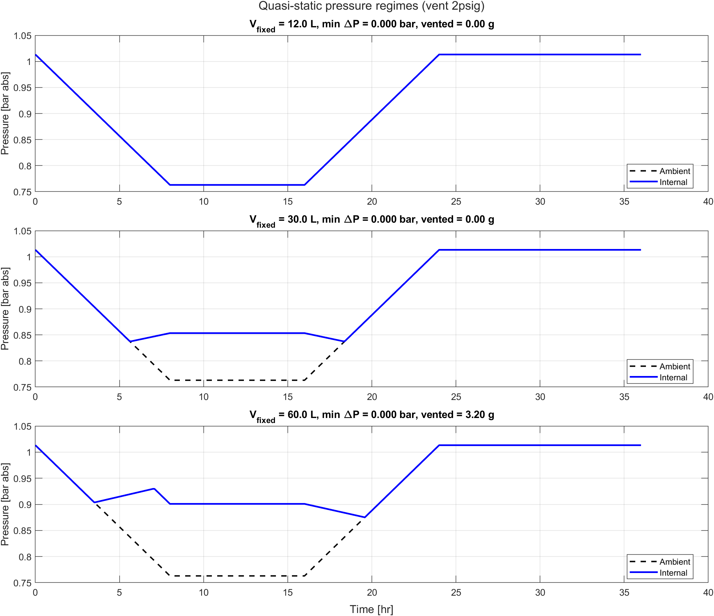
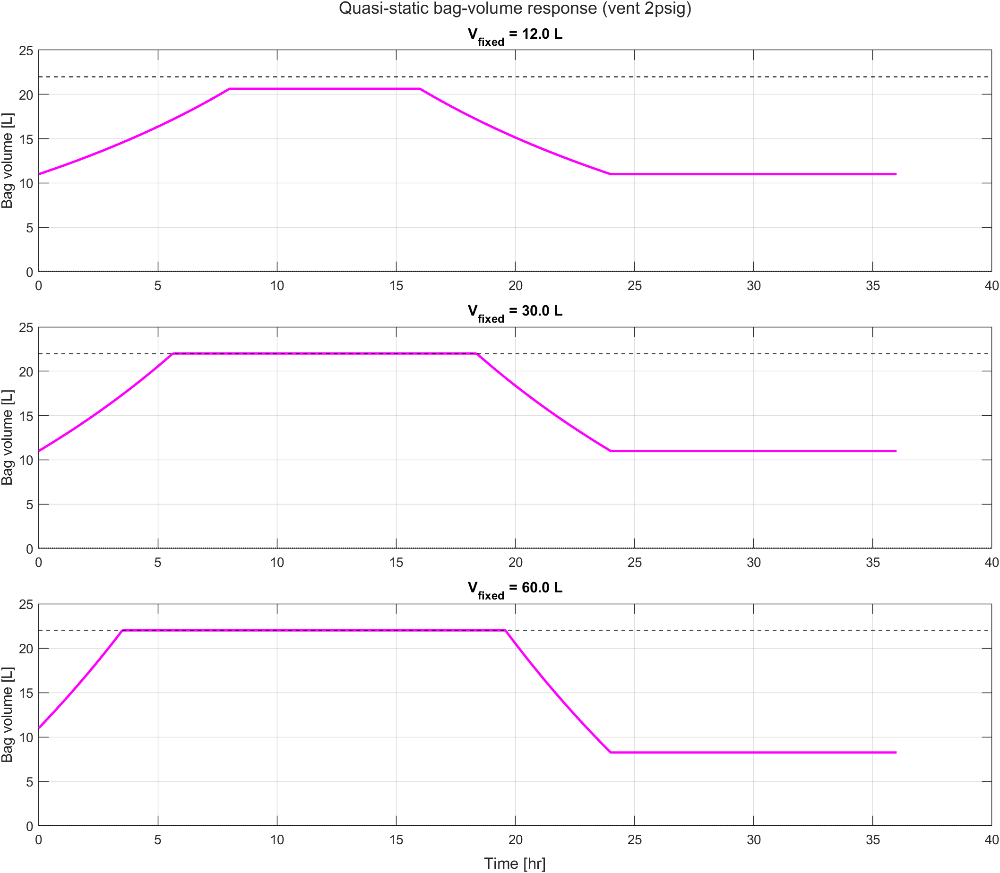
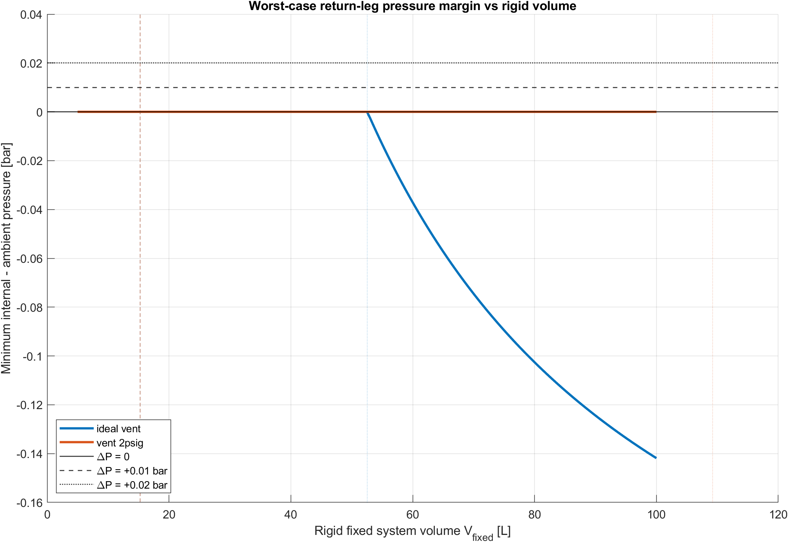

<!-- ============================================================
     PIR-SH-001: Nitrogen Shipping Cycle
     Investigates the transit thermodynamics of the nitrogen-purged
     optical assembly with the 2 PSIG bag vent valve as-built.

     Traceable findings use anchors: {#fnd-sh-nnn}
     Referenced downstream via: @fnd-sh-nnn
     ============================================================ -->

# System Description {#sec-system}

The shipped article is a manifolded optical assembly composed of multiple sealed aluminum modules connected to a common nitrogen space through PFA interconnect tubing and intake/exhaust manifolds. The total internal nitrogen space is the sum of the module interiors, the interconnect tubing, the manifold volumes, and the shipping-time compliance bag. All of these volumes communicate freely through the manifold network and behave thermodynamically as a single connected gas volume.

In operation, a continuous nitrogen purge maintains positive gauge pressure throughout the assembly. Every joint and seal is positive-pressure energized: the seating force comes from the positive internal-to-ambient pressure differential. These seals are not qualified for sub-atmospheric internal conditions. If internal pressure falls below ambient, seating force is lost and the seal admits ambient air through the same path it normally exhausts nitrogen.

During shipping, the continuous purge is unavailable. The assembly is sealed at atmospheric pressure with a fixed initial nitrogen mass, and two passive elements manage pressure excursions across the transport cycle:

1.  **Foil compliance bag** -- a CALDRY 1500 multilayer foil reservoir that expands and contracts between approximately zero and 22 L. The foil is geometrically compliant but not elastically compliant: it unfolds and refolds between hard geometric limits with negligible restoring force across its usable range.

2.  **Outward-only check/vent valve** -- permits nitrogen to escape if internal pressure exceeds ambient by the valve's 2 PSIG cracking threshold, but does not admit ambient flow inward.

@fig-three-regimes shows the intended operating sequence across the three regimes of the round-trip cycle.

{#fig-three-regimes fig-alt="Diagram showing pressure versus time across four flight phases with internal nitrogen pressure overlaid on ambient pressure. Below the curves are three schematic illustrations of an optical module with a breather bag attached, one for each failure regime. In Regime 1 the bag is partially inflated and internal pressure equals ambient. In Regime 2 the bag is fully inflated and nitrogen vents outward. In Regime 3 the bag is fully collapsed and arrows point inward at the seal locations as ambient air is drawn in."}

# Transport Envelope {#sec-envelope}

The transport state space is bounded by the shipping specification and by the ICAO standard atmosphere model used for FAA cabin altitude requirements. The relevant extremes are summarized in @tbl-transport-envelope.

::: {#tbl-transport-envelope tbl-colwidths="[35,30,35]"}
| Parameter | Value | Basis |
|:----------------------|:------------------------|:------------------------|
| Temperature range | 20 °C to 40 °C | Shipping specification |
| Maximum cabin altitude | ~8,000 ft (2,438 m) | FAA 14 CFR 25.841 |
| Ambient pressure at cabin altitude | 75.26 kPa (0.7428 atm) | ICAO standard atmosphere |
| Internal gas | Diatomic nitrogen (N~2~), ultra-pure | Purge specification |
| Maximum shipping duration | 30 to 60 days | Operational requirement |
| Bag maximum volume $V_{bag,max}$ | 22 L | CALDRY 1500 measured capacity |
| Initial bag fill $V_{bag,0}$ | ~11 L (nominal 50% fill) | Documented practice; uncontrolled |
| Bag vent cracking pressure | 2 PSIG (13.79 kPa gauge) | Valve specification |
| Rigid system volume $V_{fixed}$ | **unmeasured** | Total of modules + tubing + manifolds |

Transport envelope and key system parameters. The rigid system volume $V_{fixed}$ is the single most important unknown in the analysis.
:::

The 30 to 60 day shipping duration is significant. Even very slow inward leakage rates accumulate enough atmospheric mass over that interval to compromise nitrogen purity, particularly with respect to moisture and oxygen. The analysis that follows treats *any* sub-atmospheric internal condition as a failure, on the basis that the shipping duration is long enough to convert any quasi-static pressure deficit into a measurable contamination event.

# Field Contamination History {#sec-field-history}

::: callout-important
## Confirmed field failures motivate this analysis

Optical assemblies sealed and purged with ultra-pure nitrogen prior to shipment have returned from air transport with confirmed **moisture ingress** and **biological contamination** inside the sealed modules. Disassembly, inspection, cleaning, and re-qualification were required.

The contamination is not present at seal-up, and no operational use occurs between seal-up and post-shipment inspection. The contamination is therefore attributable to events during the transport cycle.
:::

These field failures predate the introduction of the present breather bag and check valve. The original configuration seals the manifolded assembly rigidly at atmospheric pressure with no compliance volume. During air transport the rigidly sealed system experiences the coupled pressure-temperature excursion analyzed in this document, but with no compliance reservoir and no outward relief path. Internal pressure rises and falls with the round-trip ambient and temperature cycle. On the return leg internal pressure falls below ambient, and the positive-pressure-energized seals lose seating force. Atmospheric ingress through the distributed seal network introduces moisture, oxygen, and particulates to the high-purity nitrogen space.

The breather bag and check valve concept is introduced as a passive mitigation. The intent is to provide a flexible reservoir that expands and contracts with the gas, and an outward-only valve that prevents inward flow. The mitigation addresses the original failure by providing a compliance reservoir, but it does not eliminate the underlying thermodynamic problem. As the following sections show, the mitigation is defeated by the same coupled pressure-temperature cycle if the bag is undersized relative to the rigid connected volume.

The field history establishes two facts that the rest of the document relies on. First, the seal network is **observably permeable** to atmospheric ingress under sub-atmospheric internal conditions; this is not a hypothetical concern. Second, the failure manifests over a shipping duration measured in weeks, consistent with quasi-static thermodynamics rather than transient dynamic overpressure.

# Failure Mechanism {#sec-mechanism}

The governing mechanism has three regimes. @fig-three-regimes shows the logic schematically, and @fig-vent-cycle shows the same behavior in the quasi-static model.

## Regime 1: Bag Absorbs Expansion

During ascent and heating, the nitrogen expands. As long as the bag has remaining headroom, the bag unfolds and internal pressure tracks ambient pressure. No harmful differential pressure develops.

## Regime 2: Bag Saturates and the Valve Vents Nitrogen

Once the bag reaches maximum volume, the system has no remaining geometric compliance. Continued expansion appears as pressure rise. When internal gauge pressure exceeds the 2 PSIG cracking threshold, the outward-only valve opens and nitrogen leaves the system. This is the irreversible step: the retained mole inventory is permanently reduced.

## Regime 3: Return Leg, Bag Collapse, and Sub-Atmospheric Pressure

During descent and cooling, ambient pressure rises and gas temperature falls. The bag collapses. If the bag reaches zero volume before the remaining nitrogen inventory can support ambient pressure in the rigid connected volume, internal pressure falls below ambient. The seal network becomes an inward leakage path and atmospheric contamination is thermodynamically favored.

::: {#fig-vent-cycle layout-ncol="2"}
{fig-alt="Pressure versus time for representative rigid connected volumes under 2 PSIG outward venting. Small volumes track ambient throughout. Large volumes vent nitrogen and drop below ambient on the return leg."} {fig-alt="Bag volume versus time for representative rigid connected volumes under 2 PSIG outward venting. Small volumes stay within the bag range. Large volumes reach maximum bag volume and later collapse to zero."}
Representative 2 PSIG vent cases from the quasi-static model. The failing case shows the full three-regime sequence: bag saturation, irreversible venting, then return-leg collapse and underpressure.
:::

# Governing Model {#sec-model}

The analysis uses the minimum model needed to distinguish safe compliance behavior from irreversible mass loss and return-leg underpressure.

## Assumptions

1. The working fluid is pure nitrogen (ideal gas, $\gamma = 7/5$).
2. The nitrogen is well mixed throughout the connected volume.
3. The foil bag is a geometric compliance element with negligible spring force.
4. The bag volume is clamped to $0 \le V_{bag}(t) \le V_{bag,max}$.
5. The bag valve opens at exactly 2 PSIG gauge, vents until equilibrium, and reseals perfectly. No inward flow.
6. The shipping cycle is slow enough for a quasi-static treatment.
7. Cargo hold temperature at cruise is a nominal baseline of 20 °C (see @sec-envelope).

This model is intentionally simple. It omits bag leakage, valve hysteresis, and transient fluid dynamics. That simplicity strengthens the root-cause argument: if the mechanism appears under idealized assumptions, then bag leakage is not required to explain the observed failures.

## Governing Equations

The retained nitrogen inventory and the occupied gas volume satisfy

$$V_{tot}(t) = V_{fixed} + V_{bag}(t)$$ {#eq-vtot}

and

$$P_{int}(t)\,V_{tot}(t) = n(t)\,R\,T(t).$$ {#eq-state}

For any retained inventory, the total volume required to remain at ambient pressure is

$$V_{req}(t) = \frac{n(t)\,R\,T(t)}{P_{amb}(t)},
\qquad
V_{bag,req}(t) = V_{req}(t) - V_{fixed}.$$ {#eq-vreq}

The system resolves piecewise:

- If $0 \le V_{bag,req}(t) \le V_{bag,max}$, the bag supplies the needed compliance and $P_{int}(t) = P_{amb}(t)$.

- If $V_{bag,req}(t) > V_{bag,max}$, the bag is full and the trial pressure becomes

$$P_{trial}(t) = \frac{n(t)\,R\,T(t)}{V_{fixed} + V_{bag,max}}.$$ {#eq-ptrial}

If $P_{trial}(t)$ exceeds the vent setpoint $P_{vent,abs}(t) = P_{amb}(t) + P_{vent,g}$, the valve vents until

$$P_{int}(t) = P_{vent,abs}(t),
\qquad
n(t^+) = \frac{P_{vent,abs}(t)\,\left(V_{fixed} + V_{bag,max}\right)}{R\,T(t)}.$$ {#eq-vent-reset}

- If $V_{bag,req}(t) < 0$, the bag has collapsed and the internal pressure becomes

$$P_{int}(t) = \frac{n(t)\,R\,T(t)}{V_{fixed}}.$$ {#eq-bag-collapsed}

Ingress risk exists whenever

$$\Delta P(t) = P_{int}(t) - P_{amb}(t) < 0.$$ {#eq-delta-p}

# Closed-Form Screening Thresholds {#sec-thresholds}

The piecewise model yields two closed-form screening expressions that determine whether the concept can work.

## Threshold 1: Largest Rigid Volume That Avoids Any Venting

At seal-up,

$$n_0 = \frac{P_{seal}\left(V_{fixed} + V_{bag,init}\right)}{R\,T_{seal}}.$$

At the outbound low-pressure, high-temperature peak, define

$$\alpha =
\left(\frac{P_{seal}}{P_{low}}\right)
\left(\frac{T_{hot}}{T_{seal}}\right).$$ {#eq-alpha}

The bag avoids saturation only if

$$\alpha\left(V_{fixed} + V_{bag,init}\right)
\le
V_{fixed} + V_{bag,max},$$

which gives

$$V_{fixed}
\le
\frac{V_{bag,max} - \alpha V_{bag,init}}{\alpha - 1}.$$ {#eq-no-vent}

Using the transport envelope from @tbl-transport-envelope ($P_{low} = 75.26\;\text{kPa}$, $T_{hot} = 313.15\;\text{K}$):

$$\alpha
=
\left(\frac{101.325}{75.26}\right)
\left(\frac{313.15}{293.15}\right)
= 1.438$$

$$V_{fixed}
\le
\frac{22 - (1.438)(11)}{1.438 - 1}
= 14.1\ \mathrm{L}.$$

Any rigid connected volume above **14.1 L** must vent on the outbound leg.

## Threshold 2: Largest Rigid Volume That Still Returns Nonnegative After Venting

Once the bag is full and the system has vented to the 2 PSIG setpoint,

$$P_{peak} = P_{low} + P_{vent,g} = 75.26 + 13.79 = 89.05\;\text{kPa}.$$

The retained nitrogen inventory becomes

$$n_{retained}
=
\frac{P_{peak}\left(V_{fixed} + V_{bag,max}\right)}{R\,T_{peak}}.$$

After return, once the bag has collapsed,

$$P_{return,int}
=
P_{peak}
\left(1 + \frac{V_{bag,max}}{V_{fixed}}\right)
\frac{T_{return}}{T_{peak}}.$$

To require a minimum return pressure margin $\Delta P_{req}$, define

$$\gamma(\Delta P_{req})
=
\frac{\left(P_{return,amb} + \Delta P_{req}\right)T_{peak}}
{P_{peak}\,T_{return}}.$$ {#eq-gamma}

Then the acceptable rigid volume must satisfy

$$V_{fixed}
\le
\frac{V_{bag,max}}{\gamma(\Delta P_{req}) - 1}.$$ {#eq-return-threshold}

For the nonnegative-return case ($\Delta P_{req} = 0$) under the 2 PSIG vent:

$$\gamma(0)
=
\frac{(101.325)(313.15)}{(89.05)(293.15)}
= 1.215$$

$$V_{fixed}
\le
\frac{22}{1.215 - 1}
= 102.3\ \mathrm{L}.$$

Under the 2 PSIG vent, any rigid connected volume above approximately **102 L** goes sub-atmospheric on the return leg.

::: {#tbl-thresholds tbl-colwidths="[30,22,24,24]"}
| Vent assumption | No-vent threshold | Return $\ge 0$ bar | Return $\ge +0.01$ bar |
|:----------------|------------------:|--------------------:|-----------------------:|
| 2 PSIG (as-built) | 14.1 L | ~102 L | ~97 L |

Threshold volumes from the closed-form screening expressions. All values are maximum allowable rigid connected volumes for the stated return-pressure criterion, using ICAO 75.26 kPa at 8,000 ft.
:::

# Quasi-Static Round-Trip Results {#sec-results}

@fig-min-dp-sweep shows the minimum pressure differential across the shipping cycle as a function of rigid connected volume. The differential remains at zero while the bag absorbs the outbound excursion without venting. Once venting becomes unavoidable, the pressure margin erodes with increasing $V_{fixed}$.

{#fig-min-dp-sweep fig-alt="Plot of minimum internal minus ambient pressure versus rigid connected volume. The curve stays at zero for small volumes and then declines below zero near 102 liters for the 2 PSIG vent case."}

# Findings {#sec-findings}

::: {#fnd-sh-001}
**FND-SH-001:** The system loses nitrogen mass irreversibly through the 2 PSIG outward vent whenever the rigid connected volume $V_{fixed}$ exceeds 14.1 L. The bag saturates, the valve opens, and the retained mole inventory is permanently reduced.
*Disposition: TBD*
:::

::: {#fnd-sh-002}
**FND-SH-002:** On the return leg, if $V_{fixed}$ exceeds approximately 102 L, the remaining nitrogen is insufficient to maintain ambient pressure in the rigid volume after the bag collapses. Internal pressure falls below ambient and the seal network admits atmospheric contamination.
*Disposition: TBD*
:::

::: {#fnd-sh-003}
**FND-SH-003:** The failure mechanism does not require bag leakage or valve backflow. A perfect outward-only vent and a perfect zero-stiffness bag still produce return-leg underpressure once $V_{fixed}$ exceeds the threshold. The failure is a mass-inventory problem, not a component defect.
*Disposition: TBD*
:::

::: {#fnd-sh-004}
**FND-SH-004:** The rigid connected volume $V_{fixed}$ of the production hardware is unmeasured. Where $V_{fixed}$ falls relative to the screening thresholds in @tbl-thresholds determines whether the present concept can succeed.
*Disposition: TBD*
:::

::: {#fnd-sh-005}
**FND-SH-005:** Confirmed field failures (moisture ingress, biological contamination) predate the breather bag mitigation. The same underpressure-driven contamination appears in the original rigidly sealed concept, establishing that the seal network is observably permeable under sub-atmospheric conditions.
*Disposition: TBD*
:::

# Conclusions {#sec-conclusions}

The transit model demonstrates that the nitrogen-purged optical assembly, as currently configured with a 2 PSIG outward-only bag vent, is a one-way nitrogen ratchet. Each outbound leg that saturates the bag and opens the vent permanently reduces the retained nitrogen inventory. The return leg cannot restore the lost mass.

The 14.1 L no-vent threshold is low enough that venting during transit is likely for any realistic production assembly. The ~102 L return-threshold provides additional margin, but the fundamental mechanism -- irreversible mass loss through an outward-only valve -- is present in the design regardless of where $V_{fixed}$ falls.

The immediate next step is to measure $V_{fixed}$ and compare the measurement against the screening thresholds in @tbl-thresholds.
