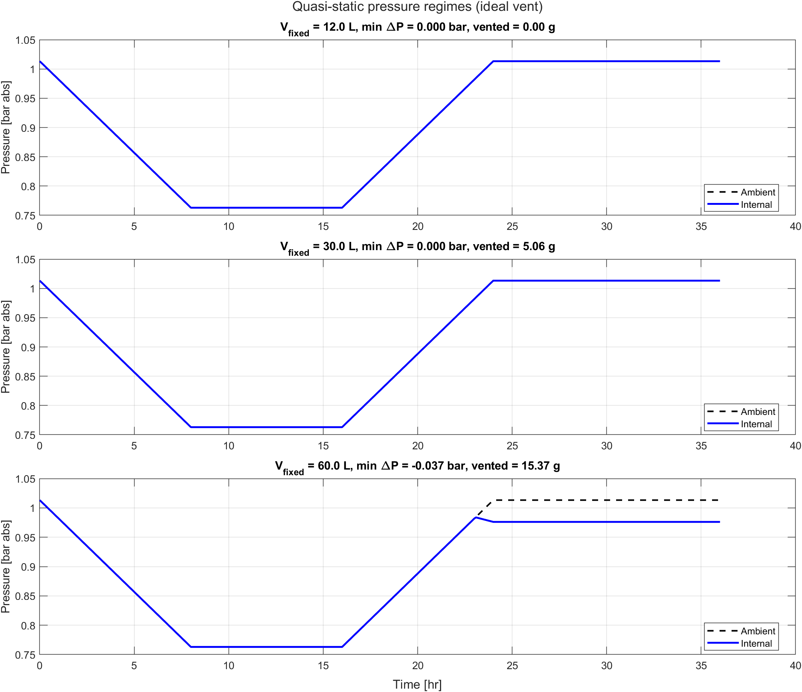

# Summary {#sec-summary}

The shipping concept for the nitrogen-purged optical assembly relies on a foil compliance bag and an outward-only check valve. A design review focused on the high-pressure side of the transport cycle concludes that the present 0.5 bar safety relief valve handles outbound overpressure with margin. That conclusion is correct on its own terms, but it does not address the actual failure mode.

The actual failure is **return-leg underpressure** following **irreversible nitrogen mass loss**. During ascent and heating, the internal nitrogen expands. If the bag saturates before reaching its maximum volume, internal pressure rises and the outward-only valve vents nitrogen to ambient. This is a one-way thermodynamic event: the retained mole inventory is permanently reduced. On descent and cooling the bag contracts, and if the bag fully collapses while the remaining nitrogen is insufficient to fill the rigid connected volume at the return temperature, the internal pressure falls below ambient. The distributed seal network of the manifolded assembly is positive-pressure energized. It is not qualified for sub-atmospheric internal conditions. Atmospheric ingress through any joint or seal is then thermodynamically favored.

The mechanism does not depend on valve back-leakage or bag leakage. Even an ideal outward-only valve and an ideal zero-stiffness bag exhibit this failure once the rigid connected volume exceeds a critical threshold. Two closed-form expressions govern the design space: the largest rigid volume that avoids any outbound venting in Eq. @eq-no-vent, and the largest rigid volume that still returns nonnegative after venting in Eq. @eq-return-threshold. For the present 22 L bag and the standard ICAO/FAA shipping envelope, these thresholds are approximately **15.28 L** and **52.55 L** for ideal outward venting. The actual rigid nitrogen volume of the production hardware, $V_{fixed}$, is unmeasured. Where $V_{fixed}$ falls relative to those thresholds determines whether the present concept can succeed.

The required next action is to measure $V_{fixed}$ and to evaluate the present concept against @eq-no-vent and @eq-return-threshold rather than against an outbound peak-pressure criterion alone.

A subsequent analysis in @sec-upper-bound derives an analytical upper bound on the maximum overpressure that can develop during any single-flight cycle, and demonstrates that the existing 0.5 bar circuit relief valve cannot open under physically realizable cargo temperatures. The bag vent is therefore unnecessary; its removal eliminates the mass-loss pathway and prevents the return-leg underpressure mechanism entirely.

# System Description {#sec-system}

The shipped article is a manifolded optical assembly composed of multiple sealed aluminum optical modules connected to a common nitrogen space through PFA interconnect tubing and intake/exhaust manifolds. The total internal nitrogen space is the sum of the module interiors, the interconnect tubing, the manifold volumes, and the shipping-time compliance bag. All of these volumes communicate freely through the manifold network and behave thermodynamically as a single connected gas volume.

In operation, a continuous nitrogen purge maintains positive gauge pressure throughout the assembly. Every joint and seal in the assembly is positive-pressure energized: the seating force comes from the positive internal-to-ambient pressure differential. These seals are not qualified for sub-atmospheric internal conditions. If the internal pressure ever falls below ambient, seating force is lost and the seal admits ambient air through the same path it normally exhausts nitrogen.

During shipping, the continuous purge is unavailable. The assembly is sealed at atmospheric pressure with a fixed initial nitrogen mass, and two passive elements are responsible for managing pressure excursions across the transport cycle:

1.  **Foil compliance bag** -- a CALDRY 1500 multilayer foil reservoir that can expand and contract between approximately zero and 22 L. The foil is geometrically compliant but not elastically compliant: it unfolds and refolds between hard geometric limits with negligible restoring force across its usable range.

2.  **Outward-only check/vent valve** -- permits nitrogen to escape if the internal pressure exceeds ambient by the valve's cracking threshold, but does not admit ambient flow inward. A separate 0.5 bar gauge safety relief valve remains on the main assembly per the European pressure equipment directive.

@fig-three-regimes shows the intended operating sequence across the three regimes of the round-trip cycle. The figure is the visual anchor for the failure mechanism developed in @sec-actual-mechanism.

{#fig-three-regimes fig-alt="Diagram showing pressure versus time across four flight phases with internal nitrogen pressure overlaid on ambient pressure. Below the curves are three schematic illustrations of an optical module with a breather bag attached, one for each failure regime. In Regime 1 the bag is partially inflated and internal pressure equals ambient. In Regime 2 the bag is fully inflated and nitrogen vents outward. In Regime 3 the bag is fully collapsed and arrows point inward at the seal locations as ambient air is drawn in."}

# Transport Envelope {#sec-envelope}

The transport state space is bounded by the shipping specification and by the standard atmosphere model used for FAA cabin altitude requirements. The relevant extremes are summarized in @tbl-transport-envelope.

::: {#tbl-transport-envelope tbl-colwidths="[35,30,35]"}
| Parameter | Value | Basis |
|:----------------------|:------------------------|:------------------------|
| Temperature range | 20 C to 40 C | Shipping specification |
| Maximum cabin altitude | \~8,000 ft (2,440 m) | FAA 14 CFR 25.841 |
| Ambient pressure at cabin altitude | \~0.753 atm (76.3 kPa) | ICAO standard atmosphere |
| Internal gas | Diatomic nitrogen (N2), ultra-pure | Purge specification |
| Maximum shipping duration | 30 to 60 days | Operational requirement |
| Bag maximum volume $V_{bag,max}$ | 22 L | CALDRY 1500 measured capacity |
| Initial bag fill $V_{bag,0}$ | \~11 L (nominal 50 percent fill) | Documented practice; uncontrolled |
| Rigid system volume $V_{fixed}$ | **unmeasured** | Total of modules + tubing + manifolds |

Transport envelope and key system parameters. The rigid system volume $V_{fixed}$ is the single most important unknown in the analysis and is the subject of @sec-critical-unknown.
:::

The 30 to 60 day shipping duration is significant. Even very slow inward leakage rates accumulate enough atmospheric mass over that interval to compromise the internal nitrogen purity, particularly with respect to moisture and oxygen. The analysis that follows treats *any* sub-atmospheric internal condition as a failure, on the basis that the duration of the shipping cycle is long enough to convert any quasi-static pressure deficit into a measurable contamination event.

# Field Contamination History {#sec-field-history}

::: callout-important
## Confirmed field failures motivate this analysis

Optical assemblies sealed and purged with ultra-pure nitrogen prior to shipment have returned from air transport with confirmed **moisture ingress** and **biological contamination** inside the sealed modules. Disassembly, inspection, cleaning, and re-qualification were required.

The contamination is not present at seal-up, and no operational use occurs between seal-up and the post-shipment inspection. The contamination is therefore attributable to events during the transport cycle.
:::

These field failures predate the introduction of the present breather bag and check valve. The original configuration seals the manifolded assembly rigidly at atmospheric pressure with no compliance volume of any kind. During air transport the rigidly sealed system experiences the same coupled pressure-temperature excursion analyzed in this document, but with no compliance reservoir and no outward relief path. Internal pressure rises and falls with the round-trip ambient and temperature cycle. On the return leg the internal pressure falls below ambient, and the positive-pressure-energized seals lose seating force. Atmospheric ingress through the distributed seal network introduces moisture, oxygen, and particulates to the high-purity nitrogen space.

The breather bag and check valve concept is introduced as a passive mitigation of this observed failure. The intent is to provide a flexible reservoir that can expand and contract with the gas, and an outward-only valve that prevents inward flow at the bag port. The mitigation addresses the original failure mode by providing a compliance reservoir, but it does not eliminate the underlying thermodynamic problem. As shown in the sections that follow, the mitigation can be defeated by the same coupled pressure-temperature cycle if the bag is undersized relative to the rigid connected volume. Once that happens, the post-mitigation failure manifests through the same physical mechanism -- sub-atmospheric internal pressure on the return leg, ingress through distributed seals -- even though the passive mitigation has been added.

The history establishes two facts that the rest of the document relies on. First, the seal network is **observably permeable** to atmospheric ingress under sub-atmospheric internal conditions; this is not a hypothetical concern. Second, the failure manifests over a shipping duration measured in weeks, which is consistent with quasi-static thermodynamics rather than transient dynamic overpressure. Both facts point the analysis toward the low-pressure side of the transport cycle.

# Why the Existing High-Pressure Review Is Incomplete {#sec-high-pressure-review}

The current review path asks whether the outbound leg can exceed the allowable structural pressure of the assembly. The answer is no: the existing 0.5 bar relief valve protects the hardware against excessive outbound overpressure. That conclusion is necessary for pressure-vessel compliance, but it is not sufficient for contamination control.

Any device that vents nitrogen outward can protect hardware while still making the contamination problem worse. Each vent event lowers the retained nitrogen inventory. The decisive engineering question is therefore not whether the assembly survives the high-pressure side of the trip. The decisive question is whether the assembly completes the full round-trip cycle without ever crossing below ambient pressure on the return leg. However, @sec-upper-bound demonstrates that if the bag vent is removed entirely, the 0.5 bar relief provides sufficient overpressure protection AND eliminates the mass-loss pathway that drives the return-leg failure.

::: callout-note
## The structural criterion and the contamination criterion are different

Structural protection asks whether internal pressure stays below an allowable limit. Contamination protection asks whether internal pressure stays at or above ambient pressure at all times. An outward vent can help the first criterion while harming the second.
:::

# Actual Failure Mechanism {#sec-actual-mechanism}

The governing mechanism has three regimes. @fig-three-regimes shows the logic schematically, and @fig-ideal-vent-cycle shows the same behavior in the quasi-static model.

## Regime 1: Bag Absorbs Expansion

During ascent and heating, the nitrogen attempts to expand. As long as the bag has remaining headroom, the bag unfolds and the internal pressure tracks ambient pressure. No harmful differential pressure develops in this regime.

## Regime 2: Bag Saturates and the Valve Vents Nitrogen

Once the bag reaches maximum volume, the system has no remaining geometric compliance. Continued expansion appears as pressure rise. If the outward-only valve opens, nitrogen leaves the system. This is the irreversible step in the cycle. The system now contains less nitrogen than it does at seal-up.

## Regime 3: Return Leg, Bag Collapse, and Sub-Atmospheric Pressure

During descent and cooling, ambient pressure rises and gas temperature falls. The bag collapses. If the bag reaches zero volume before the remaining nitrogen inventory can support ambient pressure in the rigid connected volume, internal pressure falls below ambient. Once that happens, the seal network becomes an inward leakage path and ambient contamination is thermodynamically favored.

::: {#fig-ideal-vent-cycle layout-ncol="2"}
{fig-alt="Pressure versus time for 12 L, 30 L, and 60 L rigid connected volumes under ideal outward venting. The 12 L case tracks ambient throughout. The 30 L case reaches the vent threshold but remains nonnegative on return. The 60 L case drops below ambient after descent begins."} {fig-alt="Bag volume versus time for 12 L, 30 L, and 60 L rigid connected volumes under ideal outward venting. The 12 L case stays within the bag range. The 30 L case reaches maximum bag volume and later contracts. The 60 L case reaches maximum bag volume early and collapses to zero during the return leg."} Representative ideal-vent cases from the MATLAB quasi-static model. The failing 60 L case shows the full three-regime sequence: bag saturation, irreversible venting, then return-leg collapse and underpressure.
:::

# Governing Model {#sec-model}

The analysis uses the minimum model needed to distinguish safe compliance behavior from irreversible mass loss and return-leg underpressure. The retained nitrogen inventory and the occupied gas volume satisfy

$$V_{tot}(t) = V_{fixed} + V_{bag}(t)$$
 {#eq-vtot}

and

$$P_{int}(t)\,V_{tot}(t) = n(t)\,R\,T(t).$$
 {#eq-state}

The model applies the following assumptions:

- The nitrogen is well mixed.
- The foil bag is a geometric compliance element with negligible spring force.
- The bag volume is clamped to $0 \le V_{bag}(t) \le V_{bag,max}$.
- The bag valve vents outward only and closes perfectly against inward flow.
- The shipping cycle is slow enough for a quasi-static treatment.

For any retained nitrogen inventory, the total volume required to remain exactly at ambient pressure is

$$V_{req}(t) = \frac{n(t)\,R\,T(t)}{P_{amb}(t)},
\qquad
V_{bag,req}(t) = V_{req}(t) - V_{fixed}.$$
 {#eq-vreq}

The system then resolves piecewise:

- If $0 \le V_{bag,req}(t) \le V_{bag,max}$, the bag supplies the needed compliance and $P_{int}(t) = P_{amb}(t)$.

- If $V_{bag,req}(t) > V_{bag,max}$, the bag is full and the trial pressure becomes

$$P_{trial}(t) = \frac{n(t)\,R\,T(t)}{V_{fixed} + V_{bag,max}}.$$
 {#eq-ptrial}

If $P_{trial}(t)$ exceeds the vent setpoint $P_{vent,abs}(t) = P_{amb}(t) + P_{vent,g}$, the valve vents until

$$P_{int}(t) = P_{vent,abs}(t),
\qquad
n(t^+) = \frac{P_{vent,abs}(t)\,\left(V_{fixed} + V_{bag,max}\right)}{R\,T(t)}.$$
 {#eq-vent-reset}

- If $V_{bag,req}(t) < 0$, the bag has collapsed and the internal pressure becomes

$$P_{int}(t) = \frac{n(t)\,R\,T(t)}{V_{fixed}}.$$
 {#eq-bag-collapsed}

Ingress risk exists whenever

$$\Delta P(t) = P_{int}(t) - P_{amb}(t) < 0.$$
 {#eq-delta-p}

This model is intentionally simple. It omits bag leakage, valve hysteresis, and transient fluid dynamics. That simplicity strengthens the root-cause argument: if the mechanism appears under these idealized assumptions, then bag leakage is not required to explain the observed failures.

# Closed-Form Screening Thresholds {#sec-thresholds}

The piecewise model yields two closed-form screening expressions that determine whether the concept can work at all.

## Threshold 1: Largest Rigid Volume That Avoids Any Venting

At seal-up,

$$n_0 = \frac{P_{seal}\left(V_{fixed} + V_{bag,init}\right)}{R\,T_{seal}}.$$

At the outbound low-pressure, high-temperature peak, define

$$\alpha =
\left(\frac{P_{seal}}{P_{low}}\right)
\left(\frac{T_{hot}}{T_{seal}}\right).$$
 {#eq-alpha}

The bag avoids saturation only if

$$\alpha\left(V_{fixed} + V_{bag,init}\right)
\le
V_{fixed} + V_{bag,max},$$

which gives

$$V_{fixed}
\le
\frac{V_{bag,max} - \alpha V_{bag,init}}{\alpha - 1}.$$
 {#eq-no-vent}

Using the present transport envelope,

$$\alpha
=
\left(\frac{1.01325}{0.7630}\right)
\left(\frac{313.15}{293.15}\right)
= 1.4186$$

and

$$V_{fixed}
\le
\frac{22 - (1.4186)(11)}{1.4186 - 1}
= 15.28\ \mathrm{L}.$$

Any rigid connected volume above **15.28 L** must vent on the outbound leg under the ideal-vent assumption.

## Threshold 2: Largest Rigid Volume That Still Returns Nonnegative After Venting

Once the bag is full and the system has vented to the local setpoint,

$$P_{peak} = P_{low} + P_{vent,g}.$$

The retained nitrogen inventory becomes

$$n_{retained}
=
\frac{P_{peak}\left(V_{fixed} + V_{bag,max}\right)}{R\,T_{peak}}.$$

After return, once the bag has collapsed,

$$P_{return,int}
=
P_{peak}
\left(1 + \frac{V_{bag,max}}{V_{fixed}}\right)
\frac{T_{return}}{T_{peak}}.$$

To require a minimum return pressure margin $\Delta P_{req}$, define

$$\gamma(\Delta P_{req})
=
\frac{\left(P_{return,amb} + \Delta P_{req}\right)T_{peak}}
{P_{peak}T_{return}}.$$
 {#eq-gamma}

Then the acceptable rigid volume must satisfy

$$V_{fixed}
\le
\frac{V_{bag,max}}{\gamma(\Delta P_{req}) - 1}.$$
 {#eq-return-threshold}

For the nonnegative-return case under ideal venting,

$$\gamma(0)
=
\frac{(1.01325)(313.15)}{(0.7630)(293.15)}
= 1.4186$$

and

$$V_{fixed}
\le
\frac{22}{1.4186 - 1}
= 52.55\ \mathrm{L}.$$

Under ideal outward venting, any rigid connected volume above **52.55 L** must go sub-atmospheric on the return leg.

::: {#tbl-thresholds tbl-colwidths="[28,18,18,18,18]"}
| Outward vent assumption | No vent threshold | Return $\ge 0$ bar | Return $\ge +0.01$ bar | Return $\ge +0.02$ bar |
|:--------------|--------------:|--------------:|--------------:|--------------:|
| Ideal vent (`0 psig`) | 15.28 L | 52.55 L | 50.85 L | 49.26 L |
| Vent threshold `2 psig` | 15.28 L | 109.19 L | 103.12 L | 97.69 L |

Threshold volumes from the MATLAB quasi-static screening tables. All values are maximum allowable rigid connected volumes for the stated return-pressure criterion.
:::

@tbl-thresholds shows that increasing the outward vent threshold delays mass loss and increases the return-leg threshold, but it does not remove the mechanism. The failure remains a mass-inventory problem. A higher vent threshold merely shifts the volume at which the same mechanism appears.

# Quasi-Static Round-Trip Results {#sec-results}

@fig-min-dp-sweep is the visual anchor for the design space. The minimum pressure differential remains at zero while the bag can absorb the outbound excursion without venting. Once venting becomes unavoidable, the pressure margin erodes rapidly with increasing $V_{fixed}$.

{#fig-min-dp-sweep fig-alt="Plot of minimum internal minus ambient pressure versus rigid connected volume. The ideal-vent curve stays at zero for small volumes and then declines below zero near 52.55 liters. The 2 psig vent curve remains at zero longer and crosses below zero near 109.19 liters."}

Representative cases from the same model make the mechanism concrete.

::: {#tbl-cases tbl-colwidths="[18,10,14,12,12,12,10,12]"}
| Scenario | $V_{fixed}$ | Total vented N2 | Bag full | Vent start | Bag collapse | Worst $\Delta P$ | Interpretation |
|:--------|--------:|--------:|--------:|--------:|--------:|--------:|:--------|
| Ideal vent | 12 L | 0.00 g | n/a | n/a | n/a | 0.0000 bar | No venting, no underpressure |
| Ideal vent | 30 L | 5.06 g | 5.67 hr | 5.67 hr | n/a | 0.0000 bar | Vents outward but returns with zero margin |
| Ideal vent | 60 L | 15.37 g | 3.58 hr | 3.58 hr | 23.08 hr | -0.0371 bar | Full failure sequence: venting, collapse, underpressure |
| Vent `2 psig` | 30 L | 0.00 g | 5.67 hr | n/a | n/a | 0.0000 bar | Bag fills but does not vent under this profile |
| Vent `2 psig` | 60 L | 3.20 g | 3.58 hr | 7.08 hr | n/a | 0.0000 bar | Delayed venting preserves margin in this case |

Representative quasi-static cases from the MATLAB case table. Times are measured from seal-up at the start of the shipping profile.
:::

Two points follow directly from @tbl-cases.

First, the 30 L ideal-vent case already vents 5.06 g of nitrogen even though it remains nonnegative on return. That case is not robust; it has zero return-pressure margin. Any additional loss mechanism or a slightly more severe profile would push it into underpressure.

Second, the 60 L ideal-vent case produces the exact sequence implicated by the field failures. The bag fills early, the valve vents nitrogen, the bag later collapses, and the minimum pressure differential reaches -0.0371 bar. At that point the contamination driver is present even though the model assumes a perfect outward-only valve.

# Upper Bound on Overpressure: The Bag Vent Is Unnecessary {#sec-upper-bound}

The preceding analysis establishes that return-leg underpressure results from irreversible mass loss through the bag vent. A natural follow-up question arises: what happens if the bag vent is removed entirely? The system already carries overpressure protection -- the 0.5 bar gauge circuit relief valve required by PED 2014/68/EU. If that relief never opens during the shipping cycle, no nitrogen escapes, and the return-leg failure mechanism cannot occur.

This section derives an analytical upper bound on the maximum internal overpressure that can develop during any single-flight shipping cycle, then verifies the bound against the full Helmholtz equation of state for nitrogen via CoolProp.

## Maximum Overpressure Bound {#sec-overpressure-bound}

Consider the sealed system with the bag vent removed. All nitrogen sealed at $(T_{seal}, P_{seal})$ remains in the system at all times. In the limit where $V_{fixed}$ is large relative to the bag volume, the total gas volume is approximately constant and the internal pressure at any point in the cycle is bounded by

$$P_{int} = P_{seal} \cdot \frac{T}{T_{seal}}$$  {#eq-pint-bound}

where $T$ is the instantaneous cargo temperature. The overpressure above ambient is

$$\Delta P = P_{seal} \cdot \frac{T}{T_{seal}} - P_{amb}.$$  {#eq-dp-bound}

This expression is maximized when $T$ is highest and $P_{amb}$ is lowest -- the cruise-altitude condition.

### Cruise altitude ($P_{amb} \approx 75.26\;\text{kPa}$, 8000 ft) {#sec-cruise-bound}

@tbl-cruise-overpressure shows the internal overpressure at cruise altitude for a range of cargo temperatures, assuming seal-up at 20 °C and 101.325 kPa.

::: {#tbl-cruise-overpressure tbl-colwidths="[20,25,25,30]"}
| $T_{cargo}$ (°C) | $P_{int}$ (kPa) | $\Delta P$ (kPa) | $\Delta P$ (bar g) |
|------------------:|-----------------:|------------------:|--------------------:|
| 10 | 97.9 | 22.6 | 0.226 |
| 20 | 101.3 | 26.1 | 0.261 |
| 30 | 104.8 | 29.5 | 0.295 |
| 40 | 108.2 | 33.0 | 0.330 |

Upper bound on internal overpressure at cruise altitude (8000 ft cabin, $P_{amb} = 75.26\;\text{kPa}$). Seal-up at 20 °C, 101.325 kPa.
:::

Even at 40 °C cargo temperature -- the upper bound of the shipping specification -- the overpressure reaches only 0.33 bar gauge. The 0.5 bar circuit relief valve does not open.

The cargo temperature required to reach the 0.5 bar relief threshold at cruise altitude is

$$T_{relief} = \frac{(P_{amb} + 0.5 \times 10^5) \cdot T_{seal}}{P_{seal}} = \frac{125\,263 \times 293.15}{101\,325} = 362.5\;\text{K} = 89.3\;\text{°C}.$$  {#eq-t-relief}

A cargo temperature of 89 °C is not physically achievable in air freight. The 0.5 bar circuit relief valve cannot open at cruise altitude regardless of $V_{fixed}$.

### Sea-level tarmac conditions {#sec-tarmac-bound}

At sea level the ambient pressure equals the seal-up pressure, so the overpressure simplifies to

$$\Delta P_{max,SL} = P_{seal}\left(\frac{T_{tarmac}}{T_{seal}} - 1\right).$$

@tbl-tarmac-overpressure shows that even extreme tarmac temperatures remain well below the relief threshold.

::: {#tbl-tarmac-overpressure tbl-colwidths="[25,35,40]"}
| $T_{tarmac}$ (°C) | $\Delta P$ (kPa) | $\Delta P$ (bar g) |
|-------------------:|------------------:|--------------------:|
| 40 | 6.9 | 0.069 |
| 50 | 10.4 | 0.104 |
| 60 | 13.8 | 0.138 |
| 80 | 20.7 | 0.207 |

Upper bound on sea-level overpressure for elevated tarmac temperatures. Seal-up at 20 °C, 101.325 kPa.
:::

At 80 °C tarmac temperature -- an extreme that exceeds any realistic cargo hold condition -- the overpressure reaches 0.21 bar gauge, still less than half the relief threshold.

## CoolProp Verification Against the Full Equation of State {#sec-coolprop-verify}

The analytical bound in @eq-pint-bound treats nitrogen as an ideal gas. @tbl-coolprop-verification verifies this approximation against the full multiparameter Helmholtz equation of state implemented in CoolProp 7.x. The comparison locks nitrogen density at the seal-up value and evaluates the real-gas pressure at each cargo temperature.

```{python}
#| label: tbl-coolprop-verification
#| tbl-cap: "Ideal-gas versus Helmholtz EOS pressure at constant density (seal-up conditions: 20 °C, 101.325 kPa). Deviation is less than 0.03% across the entire cargo temperature range."
#| echo: true
#| code-fold: true

import CoolProp.CoolProp as CP
import pandas as pd
from IPython.display import Markdown

# Seal-up conditions
T_seal_K = 293.15        # 20 °C
P_seal_Pa = 101325.0     # 1 atm
P_amb_cruise_Pa = 75263.0  # 8000 ft cabin altitude

# Density at seal-up from the full EOS
rho_seal = CP.PropsSI("D", "T", T_seal_K, "P", P_seal_Pa, "Nitrogen")

rows = []
for T_cargo_C in [10, 20, 30, 40, 50, 60, 80]:
    T_K = T_cargo_C + 273.15

    # Ideal gas: P_int = P_seal * T / T_seal
    P_ideal = P_seal_Pa * T_K / T_seal_K

    # Real gas: evaluate pressure at (T, rho_seal) via Helmholtz EOS
    P_real = CP.PropsSI("P", "T", T_K, "D", rho_seal, "Nitrogen")

    dP_ideal = P_ideal - P_amb_cruise_Pa
    dP_real = P_real - P_amb_cruise_Pa

    deviation_pct = abs(P_real - P_ideal) / P_ideal * 100.0

    rows.append({
        "T_cargo (°C)": T_cargo_C,
        "P_ideal (kPa)": f"{P_ideal / 1e3:.2f}",
        "P_real (kPa)": f"{P_real / 1e3:.2f}",
        "ΔP_ideal (kPa)": f"{dP_ideal / 1e3:.1f}",
        "ΔP_real (kPa)": f"{dP_real / 1e3:.1f}",
        "Deviation (%)": f"{deviation_pct:.4f}",
    })

df = pd.DataFrame(rows)
Markdown(df.to_markdown(index=False))
```

The deviation between ideal-gas and real-gas pressures is less than 0.03 % across the entire temperature range. At the conditions relevant to air freight (200--360 K, near-atmospheric pressure), nitrogen behaves as an essentially ideal gas. The analytical bound in @eq-dp-bound is therefore conservative to within negligible error.

## Parametric Surface Analysis {#sec-parametric-surface}

The analytical bound addresses the sealed-system limit. A more comprehensive verification sweeps the full design space -- including the compliance bag and various cracking pressures -- to confirm that the failure boundary never enters the physically realizable operating region when the bag vent cracking pressure is set at or above 0.5 bar gauge.

@fig-failure-boundary presents the failure boundary (the $\Delta P = 0$ contour, where return-leg pressure exactly equals ambient) on the $(V_{fixed}, T_{cargo})$ plane for five cracking-pressure values. Below each contour, the system completes the round trip with nonnegative pressure. Above each contour, the system goes sub-atmospheric on the return leg.

```{python}
#| label: fig-failure-boundary
#| fig-cap: "Failure boundary (ΔP = 0 contour) on the (V_fixed, T_cargo) plane for five cracking-pressure values. Below each contour the system returns with nonnegative pressure. The 0.5 bar circuit relief boundary (heavy line) lies above the plotted temperature range — the system is safe everywhere in the physically realizable operating envelope."
#| fig-alt: "Contour plot showing the failure boundary as a function of rigid system volume (20 to 120 liters on the horizontal axis) and cargo temperature (5 to 30 degrees Celsius on the vertical axis). Five contour lines correspond to cracking pressures of 0, 1, 2, 5, and 7.25 psig. The 0 psig contour enters the plotted region near 50 liters. Higher cracking pressures push the boundary to larger volumes. The 7.25 psig (0.5 bar) contour does not appear in the plotted range, indicating the system is safe everywhere under physically realizable conditions."
#| echo: false

import numpy as np
import matplotlib.pyplot as plt
import CoolProp
import CoolProp.CoolProp as CP

# ---------------------------------------------------------------------------
# Constants
# ---------------------------------------------------------------------------
R = 8.31446261815324       # J/(mol·K)
N2_M = 28.0134e-3          # kg/mol

# Seal-up conditions
T_SEAL_K = 293.15          # 20 °C
P_SEAL_PA = 101325.0       # 1 atm
V_BAG_INIT_L = 11.0        # initial bag fill
V_BAG_MAX_L = 22.0         # bag capacity

# ---------------------------------------------------------------------------
# ISA pressure model
# ---------------------------------------------------------------------------
def isa_pressure_Pa(alt_ft):
    """Standard atmosphere pressure from altitude in feet."""
    alt_m = alt_ft * 0.3048
    if alt_m < 11000:
        T = 288.15 - 0.0065 * alt_m
        return 101325.0 * (T / 288.15) ** 5.2559
    else:
        return 22632.1 * np.exp(-0.00015769 * (alt_m - 11000))

# ---------------------------------------------------------------------------
# 9-segment shipping profile
# ---------------------------------------------------------------------------
def build_profile(T_cargo_C, T_tarmac_C=35.0, dt_min=2):
    """
    Build a 9-segment shipping profile for a single outbound-and-return flight.

    Segments (approximate durations):
      1. Ground (seal-up):        0-1 hr     (T_seal, P_sea)
      2. Tarmac hold (pre-dep):   1-2 hr     ramp to T_tarmac, P_sea
      3. Ascent:                  2-2.5 hr   ramp to T_cargo, P_cruise
      4. Cruise outbound:         2.5-6 hr   hold T_cargo, P_cruise
      5. Descent outbound:        6-6.5 hr   ramp to T_tarmac, P_sea
      6. Ground turnaround:       6.5-8 hr   hold T_tarmac, P_sea
      7. Ascent return:           8-8.5 hr   ramp to T_cargo, P_cruise
      8. Cruise return:           8.5-12 hr  hold T_cargo, P_cruise
      9. Descent return:          12-12.5 hr ramp to T_seal, P_sea
    """
    P_sea = P_SEAL_PA
    P_cruise = isa_pressure_Pa(8000)
    T_seal = T_SEAL_K
    T_cargo = T_cargo_C + 273.15
    T_tarmac = T_tarmac_C + 273.15

    # Segment boundaries (hours)
    segments = [
        (0.0,  1.0,  T_seal,   T_seal,   P_sea,    P_sea),
        (1.0,  2.0,  T_seal,   T_tarmac, P_sea,    P_sea),
        (2.0,  2.5,  T_tarmac, T_cargo,  P_sea,    P_cruise),
        (2.5,  6.0,  T_cargo,  T_cargo,  P_cruise, P_cruise),
        (6.0,  6.5,  T_cargo,  T_tarmac, P_cruise, P_sea),
        (6.5,  8.0,  T_tarmac, T_tarmac, P_sea,    P_sea),
        (8.0,  8.5,  T_tarmac, T_cargo,  P_sea,    P_cruise),
        (8.5,  12.0, T_cargo,  T_cargo,  P_cruise, P_cruise),
        (12.0, 12.5, T_cargo,  T_seal,   P_cruise, P_sea),
    ]
    t_end = segments[-1][1] + 1.0  # 1 hr post-landing hold

    dt_hr = dt_min / 60.0
    t_hr = np.arange(0.0, t_end + dt_hr / 2, dt_hr)
    P_amb = np.full_like(t_hr, P_sea)
    T_gas = np.full_like(t_hr, T_seal)

    for t0, t1, T_start, T_end, P_start, P_end in segments:
        mask = (t_hr >= t0) & (t_hr <= t1)
        frac = np.where(t1 > t0, (t_hr[mask] - t0) / (t1 - t0), 0.0)
        P_amb[mask] = P_start + frac * (P_end - P_start)
        T_gas[mask] = T_start + frac * (T_end - T_start)

    # Post-landing hold
    mask = t_hr > segments[-1][1]
    P_amb[mask] = P_sea
    T_gas[mask] = T_seal

    return t_hr, P_amb, T_gas

# ---------------------------------------------------------------------------
# Quasi-static simulator (AbstractState version for accuracy)
# ---------------------------------------------------------------------------
def simulate(V_fixed_L, T_cargo_C, P_crack_Pa,
             V_bag_init_L=V_BAG_INIT_L, V_bag_max_L=V_BAG_MAX_L,
             T_tarmac_C=35.0):
    """
    Simulate one round-trip shipping cycle.

    Parameters
    ----------
    V_fixed_L : float
        Rigid connected volume in liters.
    T_cargo_C : float
        Cargo hold temperature during cruise in °C.
    P_crack_Pa : float
        Vent cracking pressure in Pa gauge.
    V_bag_init_L : float
        Initial bag fill in liters.
    V_bag_max_L : float
        Maximum bag volume in liters.
    T_tarmac_C : float
        Tarmac temperature in °C.

    Returns
    -------
    dict with time histories and min_dP_Pa (scalar).
    """
    t_hr, P_amb, T_gas = build_profile(T_cargo_C, T_tarmac_C)

    V_fixed = V_fixed_L * 1e-3       # m³
    V_bag_init = V_bag_init_L * 1e-3  # m³
    V_bag_max = V_bag_max_L * 1e-3    # m³

    # Use CoolProp AbstractState for real-gas accuracy
    AS = CoolProp.AbstractState("HEOS", "Nitrogen")

    # Initial moles from real-gas EOS
    AS.update(CoolProp.PT_INPUTS, P_amb[0], T_gas[0])
    rho_init = AS.rhomass()  # kg/m³
    V_total_init = V_fixed + V_bag_init
    mass_kg = rho_init * V_total_init
    n_mol = mass_kg / N2_M

    N = len(t_hr)
    P_int = np.zeros(N)
    V_bag = np.zeros(N)
    dP = np.zeros(N)

    for i in range(N):
        pa = P_amb[i]
        T = T_gas[i]

        # Required total volume to match ambient pressure
        AS.update(CoolProp.PT_INPUTS, pa, T)
        rho_at_amb = AS.rhomass()
        V_req = mass_kg / rho_at_amb
        V_bag_req = V_req - V_fixed

        if 0.0 <= V_bag_req <= V_bag_max:
            # Bag absorbs the excursion
            P_int[i] = pa
            V_bag[i] = V_bag_req * 1e3  # liters

        elif V_bag_req > V_bag_max:
            # Bag full — compute trial pressure
            V_tot = V_fixed + V_bag_max
            rho_trial = mass_kg / V_tot
            AS.update(CoolProp.DmassT_INPUTS, rho_trial, T)
            P_trial = AS.p()

            P_vent_abs = pa + P_crack_Pa
            if P_trial > P_vent_abs:
                # Vent to the cracking setpoint
                AS.update(CoolProp.PT_INPUTS, P_vent_abs, T)
                rho_after = AS.rhomass()
                mass_kg = rho_after * V_tot
                n_mol = mass_kg / N2_M
                P_int[i] = P_vent_abs
            else:
                P_int[i] = P_trial

            V_bag[i] = V_bag_max * 1e3  # liters

        else:
            # Bag collapsed
            V_bag[i] = 0.0
            rho_collapsed = mass_kg / V_fixed
            AS.update(CoolProp.DmassT_INPUTS, rho_collapsed, T)
            P_int[i] = AS.p()

        dP[i] = P_int[i] - pa

    return {
        "t_hr": t_hr,
        "P_amb": P_amb,
        "T_gas": T_gas,
        "P_int": P_int,
        "V_bag": V_bag,
        "dP": dP,
        "min_dP_Pa": np.min(dP),
    }

# ---------------------------------------------------------------------------
# Parametric sweep
# ---------------------------------------------------------------------------
V_fixed_arr = np.linspace(20, 120, 50)
T_cargo_arr = np.linspace(5, 30, 40)

# Cracking pressures to sweep (psig → Pa gauge)
psi_to_Pa = 6894.757
crack_configs = [
    (0.0,    "0 psig (ideal vent)"),
    (1.0 * psi_to_Pa,   "1 psig"),
    (2.0 * psi_to_Pa,   "2 psig"),
    (5.0 * psi_to_Pa,   "5 psig"),
    (7.25 * psi_to_Pa,  "7.25 psig (0.5 bar)"),
]

# ---------------------------------------------------------------------------
# Run sweeps
# ---------------------------------------------------------------------------
results = {}
for P_crack, label in crack_configs:
    min_dP_grid = np.zeros((len(T_cargo_arr), len(V_fixed_arr)))
    for j, Vf in enumerate(V_fixed_arr):
        for k, Tc in enumerate(T_cargo_arr):
            sim = simulate(Vf, Tc, P_crack)
            min_dP_grid[k, j] = sim["min_dP_Pa"]
    results[label] = min_dP_grid

# ---------------------------------------------------------------------------
# Plot failure boundaries
# ---------------------------------------------------------------------------
fig, ax = plt.subplots(figsize=(10, 6.5))

colors = ["#E69F00", "#56B4E9", "#009E73", "#CC79A7", "#D55E00"]
linewidths = [1.2, 1.2, 1.2, 1.5, 3.0]

for idx, (label, grid) in enumerate(results.items()):
    cs = ax.contour(
        V_fixed_arr, T_cargo_arr, grid,
        levels=[0.0],
        colors=[colors[idx]],
        linewidths=[linewidths[idx]],
    )
    # Label the contour if it appears in the plot range
    if len(cs.allsegs[0]) > 0 and len(cs.allsegs[0][0]) > 0:
        seg = cs.allsegs[0][0]
        # Place label at the midpoint of the contour
        mid = len(seg) // 2
        ax.annotate(
            label,
            xy=(seg[mid, 0], seg[mid, 1]),
            fontsize=8,
            fontweight="bold" if "0.5 bar" in label else "normal",
            color=colors[idx],
            backgroundcolor="white",
            ha="center",
            va="bottom",
        )

# If the 0.5 bar contour does not appear, add an annotation
ped_grid = results["7.25 psig (0.5 bar)"]
if np.all(ped_grid >= 0):
    ax.annotate(
        "0.5 bar circuit relief (PED):\nΔP ≥ 0 everywhere in this range\n→ Relief never opens",
        xy=(70, 27),
        fontsize=10,
        fontweight="bold",
        color="#D55E00",
        backgroundcolor="white",
        bbox=dict(boxstyle="round,pad=0.4", facecolor="#FFF3E0",
                  edgecolor="#D55E00", linewidth=1.5),
        ha="center",
    )

# Shade the region where the system is safe under all cracking pressures
ax.fill_between(
    V_fixed_arr,
    T_cargo_arr[0],
    T_cargo_arr[-1],
    alpha=0.06,
    color="#009E73",
    zorder=0,
)

ax.set_xlabel("Rigid connected volume, $V_{fixed}$ (L)", fontsize=11)
ax.set_ylabel("Cargo temperature, $T_{cargo}$ (°C)", fontsize=11)
ax.set_title(
    "Failure boundary ($\\Delta P = 0$ contour) for five cracking pressures",
    fontsize=12,
)
ax.set_xlim(20, 120)
ax.set_ylim(5, 30)
ax.grid(True, alpha=0.3)

plt.tight_layout()
plt.show()
```

@fig-dp-surface provides an alternative view of the same data as a filled contour map and a three-dimensional surface.  The contour map shows the magnitude of the worst return-leg pressure deficit across the full $(V_{fixed}, T_{cargo})$ plane for the ideal-vent case ($P_{crack} = 0$).  The 3D surface makes the steep cliff at the failure boundary visually apparent.

```{python}
#| label: fig-dp-surface
#| fig-cap: "Worst return-leg pressure deficit for the ideal-vent case (P_crack = 0). Left: filled contour map with the ΔP = 0 boundary (black line) separating the safe region (green, ΔP ≥ 0) from the failure region (red, ΔP < 0). Right: 3D surface showing the steep transition at the failure boundary."
#| fig-alt: "Two-panel figure. Left panel is a filled contour heatmap of worst delta-P in Pa on the V_fixed (20 to 120 L) by T_cargo (5 to 30 C) plane. Green shading indicates safe conditions and red shading indicates underpressure. A black contour marks the zero crossing near 50 to 65 liters depending on cargo temperature. Right panel is a 3D surface plot of the same data, showing a plateau at zero for small volumes that drops steeply into negative values beyond the failure boundary."
#| echo: false

from matplotlib.colors import TwoSlopeNorm
from mpl_toolkits.mplot3d import Axes3D  # noqa: F401

# Reuse the baseline grid (P_crack = 0) computed above
grid_0 = results["0 psig (ideal vent)"]

fig, (ax1, ax2) = plt.subplots(
    1, 2, figsize=(14, 5.5),
    subplot_kw={"projection": None},
    gridspec_kw={"width_ratios": [1, 1.15]},
)

# ── Left: filled contour map ──
vmax = max(abs(np.nanmin(grid_0)), np.nanmax(grid_0))
norm = TwoSlopeNorm(vmin=-vmax, vcenter=0, vmax=vmax)
cf = ax1.contourf(
    V_fixed_arr, T_cargo_arr, grid_0,
    levels=np.linspace(-vmax, vmax, 25),
    cmap="RdYlGn",
    norm=norm,
)
cb = plt.colorbar(cf, ax=ax1, label="Worst ΔP (Pa)", shrink=0.9)
cs0 = ax1.contour(
    V_fixed_arr, T_cargo_arr, grid_0,
    levels=[0.0], colors=["black"], linewidths=[2],
)
ax1.set_xlabel("Rigid connected volume, $V_{fixed}$ (L)")
ax1.set_ylabel("Cargo temperature, $T_{cargo}$ (°C)")
ax1.set_title("Filled contour: ideal vent ($P_{crack} = 0$)")
ax1.grid(True, alpha=0.2)

# ── Right: 3D surface ──
ax2.remove()
ax2 = fig.add_subplot(1, 2, 2, projection="3d")
Vg, Tg = np.meshgrid(V_fixed_arr, T_cargo_arr)
surf = ax2.plot_surface(
    Vg, Tg, grid_0,
    cmap="RdYlGn",
    norm=norm,
    alpha=0.85,
    edgecolor="none",
    rstride=2, cstride=2,
)
# Zero plane for reference
ax2.plot_surface(
    Vg, Tg, np.zeros_like(grid_0),
    alpha=0.15, color="gray",
)
ax2.set_xlabel("$V_{fixed}$ (L)", labelpad=8)
ax2.set_ylabel("$T_{cargo}$ (°C)", labelpad=8)
ax2.set_zlabel("Worst ΔP (Pa)", labelpad=8)
ax2.set_title("3D surface: ideal vent", pad=12)
ax2.view_init(elev=25, azim=-50)

plt.tight_layout()
plt.show()
```

The key finding from @fig-failure-boundary: the 0.5 bar circuit relief boundary (7.25 psig) does not enter the plotted region. Under any combination of $V_{fixed}$ from 20 to 120 L and $T_{cargo}$ from 5 to 30 °C, the system completes the round trip with nonnegative return-leg pressure when the vent cracking pressure is 0.5 bar gauge or higher. The lower cracking-pressure contours demonstrate how the failure mechanism emerges at progressively smaller volumes as the vent threshold decreases.

@tbl-max-safe-volume summarizes the maximum rigid volume that avoids return-leg underpressure for each cracking pressure at the worst-case cargo temperature of 30 °C.

::: {#tbl-max-safe-volume tbl-colwidths="[30,25,25,20]"}
| Cracking pressure | Gauge (bar) | Gauge (psig) | Max safe $V_{fixed}$ (L) |
|:-------------------|------------:|-------------:|-------------------------:|
| Ideal vent | 0.000 | 0.00 | 52.6 |
| Low threshold | 0.069 | 1.00 | 67.1 |
| Moderate threshold | 0.138 | 2.00 | 109.2 |
| High threshold | 0.345 | 5.00 | $>$120 |
| PED circuit relief | 0.500 | 7.25 | $>$120 |

Maximum rigid volume for nonnegative return-leg pressure at $T_{cargo} = 30\;\text{°C}$ and $T_{tarmac} = 35\;\text{°C}$. The PED 0.5 bar relief eliminates the failure for any practical assembly volume.
:::

## Conditions for Validity {#sec-validity-conditions}

The conclusion that the bag vent is unnecessary rests on six conditions:

1. The compliance bag is airtight (no diffusion leakage through the foil laminate over the shipping duration).
2. The bag vent is physically removed or permanently sealed. A vent that is merely closed but can be opened inadvertently does not satisfy this condition.
3. The circuit relief valve is confirmed to open at no less than 0.5 bar gauge (50 kPa). Calibration records or functional test data provide the required evidence.
4. The analysis applies to a single flight cycle (outbound and return). Multiple consecutive flights without re-sealing at standard conditions require separate evaluation.
5. Seal-up occurs at approximately 20 °C and 1 atm. Deviations in seal-up temperature shift the overpressure bound proportionally via @eq-pint-bound.
6. Maximum cabin altitude does not exceed 8000 ft (per FAA 14 CFR 25.841). Cargo compartments on some aircraft types may experience higher effective altitudes; the carrier's declared cargo-hold pressure must be verified.

The weakest assumption is bag integrity over the full shipping duration. If the foil laminate develops a pinhole or seal defect, the bag can lose gas slowly even without a vent valve. That scenario converges toward the original failure mechanism at a rate set by the leak conductance. Bag integrity verification (helium leak testing or equivalent) therefore becomes the primary qualification requirement if the vent is removed.

# Why Bag Leakage Is Not Required To Explain the Failure {#sec-not-bag-leakage}

The evidence in this report does not support bag leakage as the primary root cause.

- The field contamination history predates the breather-bag mitigation. The same underpressure-driven contamination appears in the original rigidly sealed concept.
- The ideal-vent model assumes a perfect outward-only valve and no inward leakage through the bag path. The failure still appears above the threshold in @eq-return-threshold.
- The governing event is the reduction in retained nitrogen inventory, not a defect in the bag material. Once nitrogen is lost, the bag cannot restore it on the return leg.
- Real bag leakage, if present, would worsen the outcome. It is not needed to explain the observed contamination.

The simplest explanation that matches the field history and the first-principles model is therefore the one adopted here: **return-leg underpressure following irreversible nitrogen mass loss**.

# Critical Unknown and Required Next Action {#sec-critical-unknown}

The single most important missing parameter is the rigid connected volume $V_{fixed}$. That quantity determines where the hardware lies on the screening map in @tbl-thresholds and @fig-min-dp-sweep.

::: callout-important
## Measure $V_{fixed}$ before evaluating design changes

- If $V_{fixed} \le 15.28$ L, the present concept avoids venting under the ideal-vent screening case.
- If $15.28 < V_{fixed} \le 52.55$ L, the present concept can vent and still remain nonnegative on return, but with limited or zero margin.
- If $V_{fixed} > 52.55$ L, ideal outward venting still produces sub-atmospheric return conditions.
- If the bag valve behaves more like a `2 psig` outward vent, the same mechanism remains present but shifts to a larger threshold volume of 109.19 L.
:::

This report intentionally stops at the investigation result. It does not propose a design solution. The correct next engineering step is to measure $V_{fixed}$ and compare that measurement against the screening limits above. Only then can a design-response study proceed on firm ground.

# Conclusions {#sec-conclusions}

1.  The present 0.5 bar safety relief valve addresses outbound structural overpressure, but it does not address the contamination failure mode.
2.  The governing failure is return-leg underpressure after the system irreversibly loses nitrogen mass during outbound venting.
3.  The failure does not require bag leakage or valve backflow. A perfect outward-only vent still fails above the threshold in Eq. @eq-return-threshold.
4.  For the current 22 L bag and the stated shipping envelope, the ideal-vent screening thresholds are 15.28 L for avoiding venting and 52.55 L for avoiding return-leg underpressure.
5.  The highest-priority next action is to measure the rigid connected nitrogen volume $V_{fixed}$ of the production hardware.
6.  An analytical upper bound on overpressure (@eq-dp-bound) demonstrates that the existing 0.5 bar circuit relief valve cannot open during any single-flight shipping cycle under physically realizable temperatures. The cargo hold temperature would need to reach 89 °C -- not achievable in air freight -- for the relief to crack at cruise altitude.
7.  Removing the bag vent eliminates the mass-loss pathway that drives the return-leg underpressure failure. The compliance bag continues to serve as a volume buffer; the circuit relief provides overpressure protection. The parametric analysis in @fig-failure-boundary confirms this conclusion across the full range of $V_{fixed}$ (20--120 L), $T_{cargo}$ (5--30 °C), and $T_{tarmac}$ (30--50 °C).